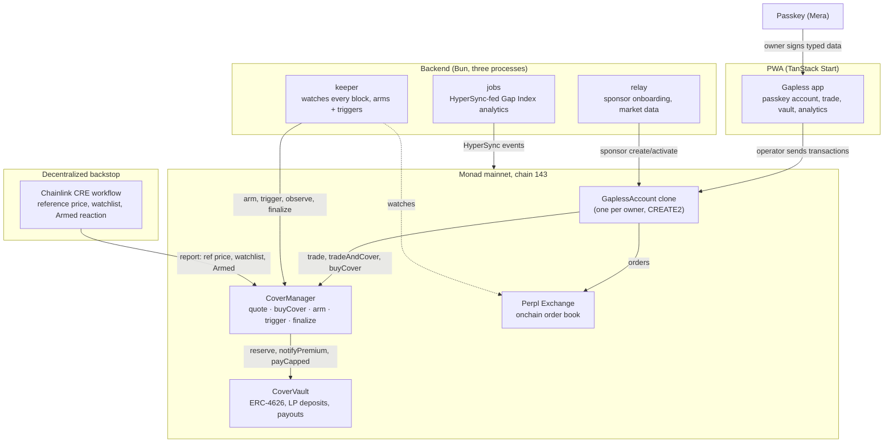

<div align="center">


# Gapless

### Stops that can't slip.

Gapless is a guaranteed stop-loss protocol for **Perpl** perpetuals on **Monad**. Tick "Guarantee" on a stop. If the market gaps through it, a public AUSD vault pays the difference — in the **same transaction** that closes your position.

<br/>


</div>

---

## The problem

Perpl's price oracle lags its own order book. Measured live this week: BTC's mark updates roughly every 50 seconds at the median, and alt-perps show real execution gaps — MON's p95 slippage vs. trigger reached 120bps. A stop-loss that fires on a stale price isn't a stop, it's a suggestion. A missed stop can cascade into a liquidation that costs far more than the gap itself.

Centralized brokers solved this decades ago with a paid "guaranteed stop" product. Nobody has ever been able to sell that guarantee onchain — because no perp venue's order book was itself a smart contract, fast enough to underwrite it atomically.

## The solution

1. A trader opens a position on Perpl and ticks **Guarantee** on their stop.
2. A keeper watches every Monad block (~300-400ms). When price crosses the stop, it **arms** in one block and **triggers** in the next.
3. The position closes with a reduce-only order. If the realized fill is worse than the stop, a public AUSD vault pays the gap — **in the same transaction**.

The payout is bounded three ways so it can't be gamed: the real measured gap, an independent Chainlink-oracle-checked reference, and a cap the trader chose (which also sets their premium). See [`MECHANISM.md`](MECHANISM.md) for the exact formulas, pulled straight from the deployed contract.

LPs underwrite the risk and earn the premiums — 10% to protocol treasury, 90% compounds into LP share value, live on the deployed `CoverVault` today, not a projection.

---

## Deployed contracts (Monad mainnet, chain 143)

| Contract | Address |
|---|---|
| CoverVault | [`0xab3CB7b3b28366eD7f6C59DbD2D708890919B289`](https://monadscan.com/address/0xab3CB7b3b28366eD7f6C59DbD2D708890919B289) |
| CoverManager | [`0xb07C20cb5328d5208A1453521b94beeB3Faa1771`](https://monadscan.com/address/0xb07C20cb5328d5208A1453521b94beeB3Faa1771) |
| GaplessFactory | [`0xB1a255e9D4CEdC20998ddC67a7Ec5e0B71bd8777`](https://monadscan.com/address/0xB1a255e9D4CEdC20998ddC67a7Ec5e0B71bd8777) |
| GaplessAccount (implementation) | [`0xc175a64BcE88dC4AC0Cfefd20daf8826b8c88cDC`](https://monadscan.com/address/0xc175a64BcE88dC4AC0Cfefd20daf8826b8c88cDC) |
| GaplessCreSink | [`0xB9908Df02187c49cc77905e62bCA73AB28d9FD1B`](https://monadscan.com/address/0xB9908Df02187c49cc77905e62bCA73AB28d9FD1B) |

All five verified on Sourcify and Monadscan. Full record with creation transactions and role assignments: [`deployments/143.json`](deployments/143.json). Market listed: BTC-PERP (perp ID 1) on [Perpl Exchange](https://monadscan.com/address/0x34B6552d57a35a1D042CcAe1951BD1C370112a6F).

---

## The stack

| Layer | Technology |
|---|---|
| Contracts | Solidity 0.8.37, Foundry 1.8.3, OpenZeppelin v5, ERC-4626 vault |
| Account layer | Mera passkey accounts (`@category-labs/mera`) — no seed phrase, no extension, no custody backend |
| Frontend | TanStack Start (React 19), TanStack Router/Query, Tailwind 4, HeroUI v3, Motion |
| Backend | Bun, Fastify 5 (relay), a keeper (arm/trigger/observe/finalize automation), HyperSync-fed jobs (Gap Index analytics) |
| Decentralized backstop | Chainlink CRE — a 3-handler TypeScript workflow acting as a liveness backstop for the keeper |
| Indexing | Envio HyperIndex over HyperSync |
| Agent integration | MetaMask Agent Wallet plugin (`mm-plugin-gapless`, oclif) — lets AI agents buy cover programmatically |

---

## Repo layout

| Path | What |
|---|---|
| [`contract/`](contract/) | CoverVault, CoverManager, GaplessFactory, GaplessAccount, GaplessCreSink — Foundry project, 508 tests |
| [`backend/`](backend/) | Relay, keeper, and jobs services — three separate Bun processes |
| [`web/`](web/) | The PWA — passkey onboarding, trading, LP vault, Gap Index analytics, cover status, agent-grant settings |
| [`plugin/`](plugin/) | MetaMask Agent Wallet plugin — `mm gapless quote/cover/status` |
| [`cre/`](cre/) | Chainlink CRE workflow (`gapless-ref`) |
| [`indexer/`](indexer/) | Envio HyperIndex — GraphQL over every Gapless event |
| [`skills/`](skills/) | Agent skill (`skills/gapless/SKILL.md`) bundled with the plugin |
| [`deployments/`](deployments/) | Mainnet deployment record (addresses, creation txs, roles) |

Setup details live in each package's `README.md` and in [`backend/RUNNING.md`](backend/RUNNING.md).

---

## Run locally

Prerequisites: [Bun](https://bun.sh), [Foundry](https://getfoundry.sh), Docker (for the backend's hardened runtime).

**Clone**

```bash
git clone https://github.com/louissarvin/gapless.git
cd gapless
```

`forge-std` (v1.17.0) and `openzeppelin-contracts` (v5.6.1) are pinned as git submodules under `contract/lib/`; `forge install` below pulls them.

**Contracts**

```bash
cd contract
forge install           # pulls the pinned submodules
forge test              # 508 tests: unit, fuzz, invariants
forge build
```

**Backend** (three processes, see `backend/RUNNING.md` for the full Docker Compose setup)

```bash
cd backend
bun install
cp .env.example .env     # fill in the values; see backend/DEPLOYMENT_143.md for every variable
bun run dev:relay        # relay on :3700
bun run dev:keeper       # keeper (needs COVER_MANAGER_ADDRESS + a funded signer with SIGMA_ROLE)
bun run dev:jobs         # HyperSync-fed Gap Index jobs
```

**Web**

```bash
cd web
bun install
# VITE_RPC_URLS, VITE_RELAY_URL, VITE_RELAY_WS_URL, VITE_RP_ID — see web/ARCHITECTURE.md section 9.1
bun dev                  # http://localhost:3200
bun run build
```

**Chainlink CRE workflow**

```bash
cd cre/gapless-cre/gapless-ref
bun install
bun run sim:ref          # dry-run the reference-price handler against live mainnet
bun run sim:watch        # dry-run the watchlist handler
```

**Envio indexer**

```bash
cd indexer
bun install
bun run codegen
envio dev                # local Docker-based Postgres + Hasura, indexes real mainnet events
```

**MetaMask Agent Wallet plugin**

```bash
cd plugin
bun install
bun run build
bun run test             # 67 tests
```

---

## Architecture



The owner passkey signs typed data only and never needs MON. The operator key (also derived from the same passkey) sends every transaction, scoped to a closed, compile-time-enforced set of allowed call destinations — it can trade and manage a vault position, but can never withdraw funds to an arbitrary address.

---

## What is real vs staged

Deliberately honest, same standard applied throughout the build: nothing below is claimed without being checked against something real.

| Area | Status |
|---|---|
| Contracts deployed, verified, 508 tests (unit, fuzz, 15 invariants) | **Live** |
| Relay + jobs running | **Live** |
| Keeper (arm/trigger/observe/finalize automation) | Built, tested against a fork rehearsal — **not currently running** |
| Full PWA (9 pages: onboarding, trade, vault, Gap Index, stats, proof, agent settings) | **Built**, wired to real backend/contract data |
| Real passkey onboarding ceremony + relay integration | **Verified working** in testing — no account yet created on a public production deployment |
| Money-moving transaction safety (confirmation sheets, duplicate-send guards) | **Security-reviewed**, no open Critical/High findings |
| Chainlink CRE workflow | Built, structure matches `cre init`'s real scaffold; **2 of 3 handlers dry-run successfully against live mainnet data** (see `contract/audit/CRE_SIMULATION_2026-10-09.md`); third handler needs a real Armed event, which doesn't exist yet |
| Envio indexer | Built, 17 tests pass; **confirmed connects to live HyperSync and reaches the real chain head** locally; full historical backfill not confirmed complete in the time observed |
| MetaMask Agent Wallet plugin | Built, 67 tests pass, clean build — **not yet published to npm**, full CLI run needs a phone-based MetaMask 2FA step |
| A real cover bought, armed, and triggered on mainnet | **Not yet** — needs the keeper running and a funded account |
| Public deployment (live URL) | **Not yet** — domain acquired, not yet pointed live |
| Git history | **Public** at [github.com/louissarvin/gapless](https://github.com/louissarvin/gapless) |

---

## Security

- 508 Foundry tests: 475 unit, 27 fuzz (1,024 runs each), 15 invariants (64 runs × 200 depth) — `GaplessOptimization`'s invariants found zero attacker-profitable sequences.
- Checks-effects-interactions throughout; `ReentrancyGuard` on every value-transfer function; `SafeERC20` for all token interactions.
- Payout bounded three independent ways specifically to prevent self-gaming (see `MECHANISM.md`).
- A dedicated frontend security review (OWASP-style, proof-of-concept verified) found no Critical or High issues across every page that signs real mainnet transactions; two Medium findings (duplicate-transaction edge cases under slow-network conditions) were found and fixed with regression tests before this README was written.

---

## Submission

Monad Metropolis Hackathon, Track 01 (Finance & Trading).

| Field | Value |
|---|---|
| Project | Gapless |
| Track | Track 01 — Finance & Trading |
| Team lead | [louissarvin](https://github.com/louissarvin) |
| GitHub | [github.com/louissarvin/gapless](https://github.com/louissarvin/gapless) |
| Community | Ethereum Jakarta |
| Mainnet deployment | chain 143, see [Deployed contracts](#deployed-contracts-monad-mainnet-chain-143) above |
| Demo URL | *pending — domain acquired, not yet live* |
| Demo video | *pending* |
| Pitch video | *pending* |

---

## Disclaimers

- **Vault risk is real, not hidden.** LPs underwrite gap risk and are paid premiums for it — they can lose the reserved liability, capped at 80% of vault assets protocol-wide and a per-market cap on top. See the vault page's own "What LPs can lose" disclosure in the app.
- **The guarantee depends on keeper liveness.** Arming and triggering are permissionless on-chain, but in practice require something actively watching the chain in near-real-time. If no keeper is running, a cover's guarantee cannot fire even if a real gap event occurs — the position still has its own native Perpl stop order, so a trader is never worse off than an uncovered trader, just without the extra protection they paid for.
- **Geo-restriction.** Perpl Exchange restricts access from the United States and United Kingdom.
- **Mainnet, real funds.** Every contract address above is live on Monad mainnet. Transactions move real AUSD.

## License

[MIT](LICENSE)

## AI use

See [`AI_USE_DISCLOSURE.md`](AI_USE_DISCLOSURE.md) for an honest account of how AI tooling was used in this build.
