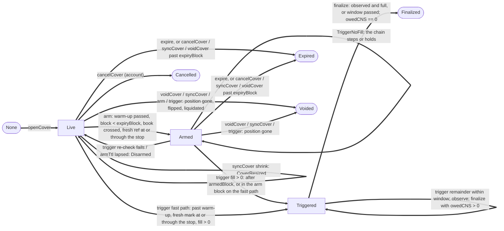

# Gapless contracts: frozen interfaces (Stage C0, 2026-10-05)

Status: **FROZEN** for S1 and S2; amended by C4 (2026-10-05, SA1 fixes, `CHANGE_REQUESTS.md` CR9 to CR19), C5 (2026-10-05, SA2 fixes, CR20 to CR28), C6 (2026-10-06, SA3 fixes, CR29 to CR33, no ABI change) and C7 (2026-10-06, SE2-H1 step gap and the CR1 review, CR34 to CR37, no ABI change). Authority order: `BUILD_PLAN.md` section 0, then `gapless/00_GAPLESS_TECH_SPEC.md`, then this file for anything the spec left open. The `.sol` files and `abi/*.json` are the source of truth; this document explains them.

## 1. Toolchain

| Item | Value | Note |
|:-|:-|:-|
| Foundry | 1.8.3 (`foundryup -i 1.8.3`, commit cae51ad) | never resume a broadcast across 1.8.3 and 1.8.4 |
| solc | 0.8.37, `via_ir = false`, optimizer on, runs 50 | deploy cost tracks code size (one-shot MON budget); runtime gas is dominated by Perpl calls |
| EVM | `osaka` | Monad docs: osaka target required; Monad is Fusaka-compatible (MIP-5 CLZ, transient storage) |
| Monad | `network = "monad"` in `[profile.default]` | exactly as the Monad Foundry guide; 128 KB code, 256 KB initcode |
| Verify | `bytecode_hash = "none"`, `use_literal_content = true` | Foundry key for the Monad guide's `metadata_hash = "none"` |
| OpenZeppelin | 5.6.1 (`lib/openzeppelin-contracts`, tag v5.6.1) | 5.7.0 breaks EIP712 name length and EnumerableSet.at |
| forge-std | 1.17.0 | pinned by the template |
| Profiles | default: fuzz 256, invariant 64 x 200, `fail_on_revert = false`, `max_block_delay = 50000`; `ci`: fuzz 1024, invariant 64 x 200; `deep`: invariant 256 x 500; `long`: invariant 2048 x 500, fuzz 10000 (C4: set in `foundry.toml`, no inline pins) | fixed seed `0x6761706c657373` |
| RPC | `[rpc_endpoints] monad = "${MONAD_RPC_URL}"` | no keys in files; no fork profile |

Commands: `forge build`, `forge test`, `FOUNDRY_PROFILE=ci forge test`, `./script/export-abi.sh`.

## 2. Files and ownership

```text
contract/
  foundry.toml                         C0 (frozen)
  INTERFACES.md                        C0
  abi/*.json                           C0, regenerated by script/export-abi.sh
  script/export-abi.sh                 C0
  script/Deploy.s.sol                  S1
  script/ListMarket.s.sol              S2
  src/types/GaplessTypes.sol           C0 (frozen)
  src/Constants.sol                    C0 (frozen)
  src/interfaces/ICoverManager.sol     C0 (frozen)
  src/interfaces/ICoverVault.sol       C0 (frozen)
  src/interfaces/IGaplessAccount.sol   C0 (frozen)
  src/interfaces/IGaplessFactory.sol   C0 (frozen)
  src/interfaces/IGaplessCreSink.sol   C0 (frozen; IReceiver lives here)
  src/interfaces/IGaplessInherited.sol C0 (ABI-only: OZ errors and Paused/Unpaused)
  src/interfaces/perpl/IPerplMin.sol   C0 (frozen; curated Perpl surface)
  src/interfaces/perpl/IPerplEvents.sol C0
  src/interfaces/perpl/IPerplErrors.sol C0 (generated from dex-sdk, unchanged)
  src/interfaces/external/IAUSD.sol    C0
  src/interfaces/external/IAggregatorV3.sol C0
  src/CoverVault.sol                   S1
  src/GaplessFactory.sol               S1
  src/GaplessAccount.sol               S1
  src/cre/GaplessCreReceiver.sol       S1 (Fri, stretch)
  src/cre/GaplessCreSink.sol           S1 (Fri, stretch)
  src/libraries/PremiumMath.sol        S2
  src/libraries/ReferenceLib.sol       S2
  src/libraries/PayoutMath.sol         S2
  src/CoverManager.sol                 S2
  test/mocks/*                         C0 (MockPerplExchange, MockAUSD, MockFeed, PerplTrader + conformance tests)
  test/mocks/reference/IPerplExchange.sol C0 (full generated interface, test-only selector check)
  test/c0/*                            C0 (frozen-surface pins, OZ composability shapes)
  test/utils/GaplessFixture.sol        S1 (deploys the real stack in Deploy.s.sol order; S2 consumes from Wed)
  test/unit/{CoverVault,GaplessFactory,GaplessAccount,GaplessCreSink}*.t.sol  S1
  test/unit/stubs/ManagerStub.sol      S1 (interim; S1 suites still use it, the real manager runs in the audit, integration and invariant suites)
  test/unit/{PremiumMath,ReferenceLib,PayoutMath,CoverManager}*.t.sol         S2
  test/unit/stubs/AccountStub.sol      S2 (interim closeForCover/creditToPerpl over PerplTrader semantics)
  test/fuzz/VaultInflation.t.sol       S1
  test/fuzz/{Quote,Payout,Params}.t.sol S2
  test/fixtures/payout_vectors.json    S2
  test/invariant/**                    S2 (handlers may import S1 fixture)
  test/audit/{SA1,SA2,SA3,C7}Audit.t.sol  C4 to C7 (audit proofs of concept, inverted to regressions)
```

## 3. Deploy and wiring order (resolves the spec's circular immutables)

`GaplessAccount` needs `FACTORY` and `MANAGER` as immutables, the factory needs `IMPL`, the manager needs the factory for `isAccount`, and the vault needs the factory for D13. Frozen resolution:

1. Deployer `AUSD.approve(vm.computeCreateAddress(deployer, nonce + 1), 1e6)`.
2. `CoverVault(AUSD, admin, Constants.defaultVaultConfig(treasury))`: constructor pulls `VAULT_SEED_CNS` from `msg.sender` and mints its shares to `0xdEaD`.
3. `CoverManager(EX, AUSD, vault, admin)`.
4. `GaplessFactory(EX, AUSD, manager, vault, BUILDER_ID)`: its constructor deploys the account implementation with `FACTORY = address(this)`; `IMPL()` returns it.
5. `manager.setFactory(factory)` (DEFAULT_ADMIN, once).
6. `vault.setManager(manager)` (DEFAULT_ADMIN, once): reads `manager.factory()`, reverts `ZeroAddress` if step 5 was skipped.
7. Roles: `RISK_ADMIN_ROLE` and `PAUSER_ROLE` (manager and vault) to deployer; `SIGMA_ROLE` to the keeper.
8. `ListMarket.s.sol` in three sessions (C5): RISK_ADMIN `run()` lists perp 1 with `defaultMarketParams()` plus the canary overrides (`maxCoverNotionalCNS` 20e6, `marketCapBps` 10,000; env `MAX_COVER_NOTIONAL_CNS`, `MARKET_CAP_BPS`); keeper `postSigma()` (27, env `SIGMA_BPS_E2`); a separate LP key `seed()` deposits 3e6 (env `SEED_DEPOSIT_CNS`) and is rejected if it holds RISK_ADMIN_ROLE. Values and sizing: `docs/CANARY_PARAMS.md`.

No upgradeability. Admin transfer uses `AccessControlDefaultAdminRules` with `ADMIN_DELAY = 1 hours`.

## 4. Cover state machine



First close (C4, SA1 H-01): arming needs a fresh reference at or through the stop, not merely within `refTolBps` (`refTolBps` only keeps an Armed cover alive on the trigger re-check). A fast-path trigger (fresh mark through the stop) is open to anyone; the armer's exclusive window applies only if it ends before `expiryBlock` (L-02). A, floorSlack, minDistance, warmup and window are the cover's purchase-time snapshot (L-03, C5). An Armed cover still triggers with no fresh reference (n == 0) at the D49 floor `stop x (1 - maxGap) x (1 - floorSlack)`, paying at most `A x SN` (CR7). The single widened floor of C4 is superseded by the stepped floor below.

Stepped close floor (C5 N-01, C6 SA3-02, C7 SE2-H1). Step 0 is `R x (1 - A)`; step k >= 1 is `min(stop, R) x (1 - min(floorSlack, A x 2^k))` (short: max and ceil); at defaults (A 5, floorSlack 100) the allowance is 5, 10, 20, 40, 80, then 100 bps. Every executed attempt updates the chain (`Cover.shortBlock`, `shortSteps`):
- An attempt runs at step k = `shortSteps` when the fresh R (and for a remainder also R_trig) is at or through the stop and the block is at most `STEP_MAX_GAP_BLOCKS` (10, about 3 s) after `shortBlock`, the chain's most recent attempt; otherwise at step 0.
- A full fill, or an attempt with R above the stop, ends the chain. `arm`, every disarm and a lapsed arm reset it.
- Thin book (short, and after the close the closing side has no level at or better than the limit: long best bid < limit or no bids): `shortBlock` = this block, `shortSteps` = min(k + 1, 6).
- Match-limited (short, but such a level remains: `maxMatchesClose` used up by dust or self-matches): a running chain keeps step k and `shortBlock` = this block (C7: the next gap is timed from this attempt, partial fill or not). With no running chain nothing starts.
- One step per block: a same-block retry reuses the step of that block's attempt (after a thin attempt `shortSteps - 1`, after a match-limited one `shortSteps`, capped case SA3-I3), and a block advances the chain at most once.

Keeper reading (C7): for a landing block L, step = `shortSteps` if `shortBlock != 0`, R through and `L - shortBlock <= 10`, else 0. A remainder must still land within `windowBlocks` (40) of `triggerBlock`.

Arm and expiry (C6, SA3-01): `arm` reverts `CoverExpired` at `block.number >= expiryBlock` and `watchList` lists no arm candidate in the expiry block; `trigger` applies `TooEarly` in the arm block only off the fast path, and `watchList` lists an Armed cover in its arm block as a trigger candidate when the mark is through. Past `expiryBlock` every end path is an expiry (N-02).

Other manager rules (CR7): early `finalize` needs `observed` and a full fill, else it waits for the window, so remainder closes keep their window; the reported `filledLots` must equal the measured position delta (`LotsExceedPosition`); `listMarket` rejects a nonzero `creRefStore` and checks Perpl and feed decimals.

Residual (N-04, disclosed): during a genuine touch (R through the stop) a third party that empties the book above the step-k floor at k attempts, each within 10 blocks of the touch's previous attempt (thin or match-limited, SA4-I3), can buy the covered lots up to `min(floorSlack, A x 2^k) - A` under `min(stop, R)`; reaching floorSlack takes 5 thin attempts, and any honest bid above the step floor at an attempt fills the trader first. Dust that only exhausts `maxMatchesClose` never widens (SA3-02). A full recovery with no executed attempt does not end a chain until 10 blocks pass (C7; was 3); on an Armed cover any caller can end it during a recovery (disarm or a step-0 attempt with R above the stop), but the keeper does not (it skips disarm-only and no-fill sends, SE1 H-1), so in practice a re-touch within 10 blocks resumes at step k on Armed and Live covers alike (SA4-I2). If Perpl's `maxBidPriceONS` / `minAskPriceONS` ever report a level that cannot fill (expired orders; unverified), the chain does not widen and the keeper keeps retrying at the current step (liveness, not a looser floor). Without a genuine touch nothing arms or fires (H-01), so no chain can start.

Rules: status only moves forward except Armed back to Live (disarm). Rounded nodes are terminal. Armed with `block > armedBlock + armTtlBlocks` is read as Live everywhere (lazy). At most one non-terminal cover per (account, perp). `isLocked` is true for Armed (within TTL and not past `expiryBlock`, C5) and Triggered (also after the window while `owedCNS > 0`; v2 may narrow it); it blocks `trade` on that perp (`PerpLocked`) but never `withdraw` (isolated margin, D44).

## 5. Frozen ABI surface

All signatures are in the `.sol` files; ABIs in `abi/`. Highlights and binding semantics below.

### 5.1 Types (`src/types/GaplessTypes.sol`)

Spec 3.3 verbatim (`CoverStatus`, `EndReason`, `DisarmReason`, `CoverParams`, `Quote`, `Cover` in 6 packed slots, `MarketConfig`, `MarketParams`, `OperatorGrant`, `CloseResult`), plus `SigmaState`, `VaultConfig {treasury, maxUtilizationBps, protocolFeeBps, minDepositCNS}`, `RedeemRequest {owner, uint96 shares, uint80 assetsAtRequest, uint48 claimableBlock}`, `PayoutBlockCap {uint48 blockNumber, uint80 capCNS, uint80 paidCNS}`. Packing casts use OZ `SafeCast`.

### 5.2 IGaplessFactory

| Kind | Items |
|:-|:-|
| Functions | `IMPL`, `MANAGER`, `AUSD`, `CREATE_ACCOUNT_TYPEHASH`, `DOMAIN_SEPARATOR`, `eip712Domain`, `accountOf(owner)`, `isAccount(account)`, `createAccount(depositCNS, grant)`, `createAccountFor(owner, grant, deadline, ownerSig)` |
| Events | `AccountCreated(owner indexed, account indexed, operator)` |
| Errors | `AccountAlreadyExists(account)`, `SigExpired`, `BadSig`, `ZeroAddress` |
| EIP-712 | domain `GaplessFactory` / `1`; `CreateAccount(address owner,address key,uint64 expiry,uint128 maxNotional,uint128 maxNotionalPerDay,uint256 deadline)` (C5); sigs checked with OZ `SignatureChecker` (EOA or ERC-1271) |

Salt `keccak256(abi.encode(owner))`. `createAccount` pulls the deposit into the clone, then calls `clone.sweep()`.

### 5.3 IGaplessAccount

| Kind | Items |
|:-|:-|
| Views | `EX`, `AUSD`, `FACTORY`, `MANAGER`, `VAULT`, `BUILDER_ID` (uint8, 0), `WITHDRAW_TYPEHASH`, `SET_OPERATOR_TYPEHASH`, `DOMAIN_SEPARATOR`, `eip712Domain`, `owner`, `operator`, `operatorUsage` (C5), `perplAccountId` (0 = inactive), `opNonce` (Withdraw and SetOperator; `setOperator` and `revokeOperator` also bump it, CR3) |
| Anyone | `sweep()`, `depositWithPermit(amount, deadline, v, r, s)`, `withdrawWithSig(amount, deadline, sig)`, `setOperatorWithSig(grant, deadline, sig)` |
| Owner or live operator | `trade(OrderDesc)`, `tradeAndCover(OrderDesc, CoverParams, maxPremiumCNS)`, `buyCover(CoverParams, maxPremiumCNS)`, `cancelCover(coverId)` |
| Owner | `withdraw(amount)` (pays owner only), `setOperator(grant)`, `revokeOperator()` |
| Factory | `initialize(owner, grant)` once |
| Manager | `closeForCover(perpId, isLong, lots, limitPNS, maxMatches) returns CloseResult`, `creditToPerpl(amount)` |
| Events | `OperatorSet(key, expiry, maxNotionalPerTradeCNS, maxNotionalPerDayCNS)` (C5 topic0), `PerplActivated`, `Traded`, `Withdrawn`, `Swept(amount)`, `Credited(amount, toPerpl)` (payouts only; refunds are plain AUSD transfers with no account event) |
| Errors | spec list plus `ZeroAddress`, `PremiumUnfunded(need, available)`, `LimitOffMarket(limit, mark)`, `CloseExceedsPosition(lots, positionLots)` (C4), `OperatorBudgetExceeded(notional, available)` (C5) |

Binding semantics:
- Operator live iff `msg.sender == key && block.timestamp < expiry`; an expired key reverts `OperatorExpired(expiry)`.
- Operator budget (C5, N-03): `OperatorGrant.maxNotionalPerDayCNS` is a leaky bucket refilling linearly over `OPERATOR_WINDOW_SEC` (1 day): every operator order except types 4 and 5 (closes included) is charged `lotLNS * max(pricePNS, mark) * scale`, and operator `buyCover` / `tradeAndCover` are charged the cover notional; over budget reverts `OperatorBudgetExceeded(notional, available)`. 0 blocks operator trades and buys. Usage survives grant changes (re-issuing a grant does not refill it). C6 (SA3-I4): on every grant change and on revoke, usage is first checkpointed at the outgoing grant's rate, so a new cap applies only from then on; while revoked nothing decays. The owner is never charged. `operatorUsage()` returns `(used, available)`. Operators may `cancelCover` even with a zero budget (SA3-I5, by design).
- `trade` overwrites `orderDescId` with `++descId`; types 0..6. Operator orders (C4, M-01): the limit must sit within `OPERATOR_MAX_LIMIT_DEVIATION_BPS` (500) of Perpl's mark for types 0, 1, 2, 3 and 6 (`LimitOffMarket`, also when the mark is 0); notional for types 0, 1 and 6 is `lotLNS * max(pricePNS, mark) * 10^(6 - pd - ld)` (pd, ld from `EX.getPerpetualInfo`, so unlisted perps work); closes (2, 3) may not exceed the position (`CloseExceedsPosition`). Types 4 and 5 carry no price and are not checked. The owner is never restricted. Uses `execOrderV2(d, "")` because `BUILDER_ID == 0`. After the order, if `manager.activeCoverOf(this, perpId) != 0`, call `manager.syncCover`.
- Premium: `q = manager.quote(this, p)`; pay `escrow + rent` from wallet AUSD first, then `EX.withdrawCollateral(shortfall)`; `forceApprove(manager, need)`, `openCover`, `forceApprove(manager, 0)`.
- `closeForCover`: recipe of 01 section 8 for both sides (`orderType` 2 or 3, IOC, `leverageHdths 0`, `maxNegPnlCollatBPS 0`, `lastExecutionBlock = block.number`, `maxMatches` from the manager); lots clamped to the position; zero result if the position is gone or on the other side; `takerFeePpm = getPerpFeeSchedule(perpId).taker[getAccountFeeTier(id)]`.
- `creditToPerpl` never reverts on the account side: `try EX.depositCollateral` and keep AUSD in the wallet on failure or when inactive.
- `depositWithPermit`: AUSD domain "Agora Dollar" v1; wrap `permit` in try/catch and proceed if the allowance is already sufficient (front-run safe).
- Account mutators use `ReentrancyGuardTransient`. The manager never calls account hooks from inside an account-originated call (see conflict C6).

### 5.4 ICoverManager (is IAccessControlDefaultAdminRules)

| Kind | Items |
|:-|:-|
| Views | `RISK_ADMIN_ROLE`, `SIGMA_ROLE`, `PAUSER_ROLE`, `EXCHANGE`, `AUSD`, `VAULT`, `factory`, `quote`, `getCover`, `activeCoverOf`, `isLocked`, `referencePrice(perpId, isLong, minTs)`, `watchList(perpId, max)`, `housekeeping(perpId, max)`, `liveCount`, `isSettling`, `scaleOf`, `marketConfig`, `marketParams`, `sigmaOf`, `listedPerps`, `coverNonce`, `paused`, `marketPaused(perpId)`, `refundOwed(account)`, `refundOwedTotal` (C4); concrete-only getters `F_SIGMA_POST` (33), `SCAN_LIMIT` (512) |
| Account-only | `openCover(account, p, maxPremium)`, `syncCover(account, perpId)`, `cancelCover(account, coverId)`; require `msg.sender == account && factory.isAccount(account)` |
| Permissionless | `arm`, `trigger`, `observe`, `finalize`, `expire`, `voidCover`, `claimRefund(account)` (C4, pays the account only) |
| Roles | `setFactory` (DEFAULT_ADMIN once), `listMarket`, `setMarketParams` (RISK_ADMIN), `postSigma` (SIGMA_ROLE, bounded [5, 2000]), `pauseBuys`, `unpauseBuys` (PAUSER_ROLE, OZ Pausable), `pauseMarket(perpId)`, `unpauseMarket(perpId)` (PAUSER_ROLE, C4) |
| Events (18) | `FactorySet`, `MarketListed`, `MarketParamsSet`, `SigmaPosted`, `CoverBought`, `CoverResized`, `Armed`, `Disarmed`, `TriggerNoFill`, `Triggered`, `Observed`, `Finalized`, `CoverEnded`, `PayoutDeferred`, `EscrowForfeited`, `RefundOwed`, `RefundClaimed`, `MarketPauseSet` (the last four C4); OZ role and default-admin events; `Paused`/`Unpaused` via `IGaplessInherited` |
| Errors | spec list plus `MarketAlreadyListed`, `ZeroLots`, `MarkStale(markTs)`, `NotCoverAccount`, `CoverExpired`, `ConditionNotMet`, `PositionIntact`, `FactoryAlreadySet`, `ZeroAddress`, `MarketPaused`, `CoverShareExceeded`, `NoRefundOwed` (C4); paused buys revert OZ `EnforcedPause()` |

Binding semantics:
- `coverId = keccak256(abi.encode(account, perpId, coverNonce[account]++))`. Armed topic0 = `keccak256("Armed(bytes32,uint256,address,uint256,uint256,uint256)")` (pinned by `test/c0`).
- Book side is empty when its ONS is `0` (measured) or `type(uint256).max` (defensive). Long arm: `maxBidPriceONS empty || bestBid <= stop`. Short arm: `minAskPriceONS empty || bestAsk >= stop` (conflict C1).
- Escrow refunds in `syncCover`, `cancelCover`, `expire`, `voidCover` and `finalize` are plain transfers to `cover.account` (a registered clone). Only payouts from `trigger` and `finalize` call `creditToPerpl`. C4 (L-05): refunds use `trySafeTransfer`; a failed refund (frozen AUSD) is recorded in `refundOwed[account]` (`RefundOwed`) and paid by the permissionless `claimRefund(account)`, so end paths never brick and the reservation is released.
- Escrow at expiry (C5, N-02, decided): once `block.number > expiryBlock`, `expire`, `cancelCover` (Live or Armed), `syncCover` and `voidCover` all end the cover as `Expired` and refund the escrow unless the cover was ever armed. The outcome does not depend on who calls, when, prices, sigma or params, and reads no Perpl state.
- Escrow retention before expiry (C4, M-03, product decision; C5 inputs): on every non-trigger end (`cancelCover`, `expire`, `voidCover`, and the void or shrink in `syncCover`) the escrow (or the freed part on a shrink) is refunded only when the cover was never armed and the least favorable fresh reference among mark, oracle and feed is at least the cover's purchase-time `minDistanceBps` from the stop (C5: no live sigma or params). A reverting Perpl view drops mark and oracle (the feed alone can still prove distance) instead of bricking the end path. Otherwise (near or through the stop, no fresh reference, or armed at any point) the vault keeps it as premium (`EscrowForfeited`). An owner who exits near the stop with its own trade therefore cannot recover the escrow. A triggered cover keeps C16: the escrow share of unfilled lots is refunded at finalize.
- Quote distance (C4, M-02): measured from the least favorable fresh source among mark, oracle, feed (floored for longs) and the book top (best bid for longs, best ask for shorts; an empty side is skipped). A source at or through the stop reverts `StopWrongSide`; closer than `minDistance` reverts `StopTooClose`. The fresh mark is still required (`MarkStale`).
- `observe` (C4, L-01): needs two fresh post-trigger sources, or one that is not Perpl's mark. Mark alone counts only on a market with no other source (no feed and Perpl `ignOracle`). Otherwise it returns false and finalize after the window uses the trigger reference.
- Capacity (C4, L-09): one cover's Cap may use at most `MAX_COVER_CAP_SHARE_BPS` (10%) of `totalAssets x marketCapBps` (`CoverShareExceeded`). C5: rent is at least `minFeeCNS` per started `RENT_FLOOR_PERIOD_BLOCKS` (12,000), so pinning a market (at least 10 covers) costs at least 10 x minFee per hour; a default 1 h cover is unchanged.
- Snapshots (C5, L-03): A, floorSlack, minDistance, warmup and window are fixed per cover at purchase. Read live: `refTolBps`, `armTtlBlocks`, `exclusiveBlocks`, `perBlockPayoutCapBps`, `maxMatchesClose`, `refFreshSec`, `feedMaxAgeSec` (why each is safe: `docs/C5_FIXES.md`).
- Close limits are clamped to Perpl's `[1, 16,777,215]` (C4, L-06); `listMarket` rejects a perp with `basePricePNS != 0`.
- Deferred payouts (C4, L-08): every change of a cover's `owedCNS` is reported with `vault.updateOwed`; at any finalize that leaves `owedCNS > 0` (past the window, or early when observed and fully filled), the reservation above `paid + owed` is released (Cap shrinks to `paid + owed`).
- Bounded scans (CR8): each `watchList` or `housekeeping` call inspects at most `SCAN_LIMIT` (512) live covers, rotating the start by block number when the set is larger; `max` is capped at 512.
- Close floor steps: section 4 (keeper reading included). Constants: `STEP_MAX_GAP_BLOCKS` 10 (C7), `CLOSE_FLOOR_MAX_STEPS` 6.
- `pauseMarket(perpId)` / `unpauseMarket(perpId)` (PAUSER_ROLE, I-02) block quotes and buys on one market (`MarketPaused`); lifecycle calls never pause.
- `trigger` and `finalize` wrap `vault.payCapped` and `account.creditToPerpl` in try/catch; a failure records `owedCNS` (deferral, never denial).
- Remainder retries (L-07): each `trigger` on a Triggered cover fills `min(remaining, position)` or consumes `maxMatchesClose` resting orders of at least one lot each, and may be repeated within a block, so dust spam costs the keeper at most `ceil(lots / maxMatchesClose)` calls inside the window.
- `setMarketParams` and `listMarket` revert `ParamOutOfBounds(Constants.F_*)`, including the cross-field rules F_DURATION_ORDER, F_COOLDOWN_COVERAGE, F_WARMUP_VS_DURATION, F_MARKET_CONFIG and (C6) F_FLOOR_SLACK_VS_SLIP (34: floorSlack >= 2A, so every widened step is wider than step 0); `postSigma` out of bounds reverts `ParamOutOfBounds(F_SIGMA_POST = 33)`.
- Implementations must declare `paused() override(ICoverManager, Pausable)` (see `test/c0/Implementable.sol`).

### 5.5 ICoverVault (is IERC4626, IAccessControlDefaultAdminRules)

| Kind | Items |
|:-|:-|
| Views | `PAUSER_ROLE`, `COOLDOWN_BLOCKS`, `DEPOSIT_LOCK_BLOCKS`, `manager`, `factory`, `config`, `getRequest`, `requestIdsOf`, `nextRequestId`, `reserved`, `reservedTotal`, `owedTotal` (C4), `freeAssets` (gross assets - reserved), `utilizationBps` (reserved / gross assets), `lockUntil`, `blockPayout`, `paused`, all ERC-4626 views |
| LP | `deposit`, `mint` (receiver must be `msg.sender`), `requestRedeem(shares)`, `claimRedeem(requestId, receiver)` |
| Manager | `reserve(perpId, amount, marketCapBps)`, `release(perpId, amount)`, `payCapped(perpId, account, amount, perBlockCapBps)`, `notifyPremium(amount)`, `updateOwed(fromCNS, toCNS)` (C4) |
| Admin | `setManager` (once), `setConfig` (bounded, `ConfigOutOfBounds(i)`: 0 treasury, 1 maxUtilization, 2 protocolFee, 3 minDeposit, `Constants.C_*`), `pause`, `unpause` (PAUSER_ROLE) |
| Events | spec list (`RedeemRequested`, `RedeemClaimed`, `Reserved`, `Released`, `Paid`, `PremiumReceived`) plus `ManagerSet`, `ConfigSet`, `OwedUpdated` (C4); ERC-4626 `Deposit`, ERC-20 `Transfer`/`Approval`; `Paused`/`Unpaused` via `IGaplessInherited` |
| Errors | spec list plus `ReleaseExceedsReserved`, `ThirdPartyDeposit`, `NotRequestOwner`, `ManagerAlreadySet`, `ZeroAddress`, `ConfigOutOfBounds` |

Binding semantics (C4, L-08): `totalAssets()` is the internal accounting net of `owedTotal` (payouts deferred by the per-block cap or a failed transfer), so redeem requests and deposits price the known liability at once; reservations, the per-block cap snapshot, `freeAssets` and `utilizationBps` use the gross amount (`totalAssets + owedTotal`), and `owedTotal <= reservedTotal`. `quote().utilAfterBps` uses net `totalAssets`, so it reads slightly above `utilizationBps` while payouts are owed. `setConfig` and `setManager` reject `treasury == manager` (I-03). `_decimalsOffset() = 6`; shares move only by mint, burn and request escrow (`_update` override, else `NonTransferable`); `withdraw`/`redeem`/`previewWithdraw`/`previewRedeem` revert `AsyncOnly`, `maxWithdraw`/`maxRedeem` return 0; `payCapped` requires `factory.isAccount(account)` (`NotAccount`), pays `min(amount, cap snapshot remaining, reserved[perpId])`, consumes the same reservation, returns 0 when the block cap is spent; `claimRedeem` pays `min(assetsAtRequest, convertToAssets(shares))` floor, receiver nonzero; LP entry points revert `Settling()` while `manager.isSettling()`. Recommended: internal asset accounting for `totalAssets` (donations do not move the price). Implementations must declare `paused() override(ICoverVault, Pausable)`.

### 5.6 IGaplessCreSink (stretch)

`onReport(metadata, report)` (forwarder only), `supportsInterface`, `forwarder`, `chainSelector`, `manager`, `lastSeq(kind, perpId)`, `seen(reportHash)`, `MAX_IDS`; C4 (L-04): a report is processed once (C5, N-06: keyed by `keccak256(abi.encode(decoded fields))`, so trailing bytes or other offsets cannot replay its content), accepted when `seq` is within `[now - max age, now]` (kinds 1, 2: seconds, max age 120, 2 s future tolerance; kind 3: Armed block, max age 400 blocks), so a forged report can never drop a different genuine one; `lastSeq` per (kind, perpId) is monitoring only; event `CreReport(kind, perpId, refPricePNS, armed, triggered)`; errors `NotForwarder`, `WrongChain(uint64)`. Report = `abi.encode(uint8 kind, uint64 chainSelector, uint64 seq, uint256 perpId, uint256 refPricePNS, bytes32[] toArm, bytes32[] toTrigger)`, decoded as a flat tuple. Kinds 1 ref, 2 watch, 3 Armed log. Code shape: `gapless/04 section 1.7`.

### 5.7 Roles

| Role | Hash | Holder (canary) | Powers |
|:-|:-|:-|:-|
| DEFAULT_ADMIN | 0x00 | `ADMIN` env (deployer until it accepts the scheduled transfer; deployer by default, with a warning), 1 h transfer delay | `setFactory`, `setManager`, `setConfig`, grant and revoke |
| RISK_ADMIN_ROLE | `keccak256("RISK_ADMIN_ROLE")` | `RISK_ADMIN` env (deployer by default, with a warning); runs ListMarket `run()`, never the LP seed | `listMarket`, bounded `setMarketParams` (A, floorSlack, minDistance, warmup and window never move live covers) |
| SIGMA_ROLE | `keccak256("SIGMA_ROLE")` | keeper | bounded `postSigma` |
| PAUSER_ROLE | `keccak256("PAUSER_ROLE")` | `PAUSER` env (deployer by default, with a warning) | buys (manager, global or per market), deposits (vault); never triggers, finalize or claims |

### 5.8 Inherited and external errors

`abi/IGaplessInherited.json` (OZ Pausable, ReentrancyGuardTransient, SafeERC20, ERC4626, ERC20, SafeCast, Clones, ECDSA), `abi/IPerplErrors.json` (bubbles out of `trade`, `tradeAndCover`, `withdraw`), `abi/IAUSD.json` (`AccountIsFrozen`, `TransferPaused`, `Erc2612*`). The PWA maps `AccountIsFrozen`, `TransferPaused` and `AusdFrozen` to "Your dollars are temporarily unavailable".

## 6. Constants (`src/Constants.sol`)

| Name | Default | Bounds | Field index |
|:-|:-|:-|:-|
| slipAllowanceBps (A) | 5 | [5, 50] | 0 |
| maxGapBpsCap | 200 | [50, 500] | 1 |
| floorSlackBps | 100 | [10, 300] | 2 |
| refTolBps | 50 | [0, 200] | 3 |
| minStopDistanceBps | 10 | [5, 500] | 4 |
| kDistE2 | 300 | [100, 1000] | 5 |
| loadBps | 5000 | [0, 20000] | 6 |
| rentAprBps | 2000 | [0, 10000] | 7 |
| uKinkBps / slope1Bps / slope2Bps | 5000 / 5000 / 40000 | [1000, 9000] / [0, 20000] / [0, 60000] | 8 / 9 / 10 |
| marketCapBps | 5000 | [500, 10000] | 11 |
| perBlockPayoutCapBps | 2500 | [100, 10000] | 12 |
| maxLossToDepositBps | 4000 | [1000, 6000] | 13 |
| impactBpsPerKE2 | 10 | [0, 1000] | 14 |
| maxMatchesClose | **16** (C4; was 32) | [8, 200] | 15 |
| warmupBlocks | 200 | [100, 2000] | 16 |
| armTtlBlocks | 200 | [10, 400] | 17 |
| exclusiveBlocks | 3 | [0, 10] | 18 |
| windowBlocks | 40 | [10, 200] | 19 |
| minDurationBlocks / maxDurationBlocks | 1000 / 48000 | [500, 48000] each | 20 / 21 |
| sigmaMaxAgeBlocks | **6000** (BUILD_PLAN; spec 600) | [100, 6000] | 22 |
| refFreshSec | 60 (+2 s tolerance) | [10, 120] | 23 |
| feedMaxAgeSec | 120 | [30, 3600] | 24 |
| minFeeCNS | 20,000 | [0, 1e6] | 25 |
| maxCoverNotionalCNS | **50e6** (code default; the canary lists 20e6, section 3 step 8; spec 2000e6) | [10e6, 100000e6] | 26 |
| zEdgesE2[8] | 50, 100, 150, 200, 250, 300, 400, 600 | strictly increasing, first > 0 | 27 |
| gapBpsE2[9] | 194, 91, 101, 143, 229, 452, 492, 999, 950 | each <= maxGapBpsCap x 100 | 28 |
| cross: min <= max duration | | | 29 |
| cross: maxDuration + window + armTtl <= 48,300 | | | 30 |
| cross: warmup < minDuration | | | 31 |
| listMarket config: pd + ld <= 6, feedDecimals >= pd, perpId <= uint16 max | | | 32 |
| postSigma out of [5, 2000] (`Constants.F_SIGMA_POST`, also the `CoverManager.F_SIGMA_POST` getter) | | | 33 |
| cross (C6, SA3-I6): floorSlackBps >= 2 x slipAllowanceBps | | | 34 |
| Cover maxGapBps | default 200 | [50, market.maxGapBpsCap] | |
| Sigma post | calm 27, stressed 163 | [5, 2000] | |
| Vault maxUtilizationBps / protocolFeeBps / minDepositCNS | 8000 / 1000 / 1e6 | [1000, 9000] / [0, 3000] / [1e6, 100e6] | config 1 / 2 / 3 (`C_*`; 0 is the treasury) |
| Vault decimalsOffset, seed, cooldown, deposit lock | 6, 1e6 to `0xdEaD`, 48,300, 48,300 | constants | |
| BUILDER_ID / builder fee | 0 / 0 (`ext = ""`) | constant | |
| BLOCKS_PER_YEAR | 105,120,000 | constant | |
| CRE MAX_IDS, kinds, chain selector | 3; 1, 2, 3; 8481857512324358265 | constant | |
| Addresses | Exchange `0x34B6...2a6F`, AUSD `0x0000...012a`, feeds BTC/ETH/MON, CRE sim and prod forwarders, Perpl Safe, DEAD | constant | |
| PERPL_NATIVE_STOP_SLIPPAGE_BPS | 100 (analytics only) | constant | |
| PERPL_MIN_PRICE_PNS / PERPL_MAX_PRICE_PNS (C4) | 1 / 16,777,215 | constant (mainnet `PriceOutOfRange`) | |
| OPERATOR_MAX_LIMIT_DEVIATION_BPS (C4) | 500 | constant | |
| MAX_COVER_CAP_SHARE_BPS (C4) | 1000 | constant | |
| CRE_REPORT_MAX_AGE_SEC / CRE_REPORT_MAX_AGE_BLOCKS (C4) | 120 / 400 | constant | |
| STEP_MAX_GAP_BLOCKS (C7; C5 `SHORT_CHAIN_MAX_GAP_BLOCKS` 3) / CLOSE_FLOOR_MAX_STEPS (C5) | 10 / 6 | constant | |
| RENT_FLOOR_PERIOD_BLOCKS (C5) | 12,000 | constant | |
| OPERATOR_WINDOW_SEC / OPERATOR_MAX_NOTIONAL_PER_DAY_DEFAULT_CNS (C5) | 1 day / 1000e6 (client default) | constant | |

Keeper daily MON spend is enforced offchain (BUILD_PLAN W3); there is no onchain constant for it.

## 7. Library signatures (as implemented in `src/libraries/`)

Rounding rule: every amount the user pays or the vault keeps rounds toward the vault; every payout rounds down.

```solidity
library PremiumMath {
    struct QuoteInput {
        uint256 lots; uint256 stopPNS; bool isLong; uint16 maxGapBps; uint32 durationBlocks;
        uint256 markPNS; uint256 scale; uint256 sigmaBlkBpsE2;
        uint256 reservedTotalCNS; uint256 totalAssetsCNS; uint256 blockNumber;
    }
    function notionalCNS(uint256 lots, uint256 stopPNS, uint256 scale) internal pure returns (uint256);
    /// floor; reverts StopWrongSide when the stop is not on the loss side of mark
    function distanceBps(uint256 markPNS, uint256 stopPNS, bool isLong) internal pure returns (uint256);
    /// max(minStopDistanceBps, floor(kDistE2 * sigma * sqrt(warmupBlocks) / 1e4)) (CR6: floor, premium.ts parity)
    function minDistanceBps(MarketParams memory p, uint256 sigmaBlkBpsE2) internal pure returns (uint256);
    /// floor(d * 1e4 / (sigma * Math.sqrt(T)))
    function zE2(uint256 dBps, uint256 sigmaBlkBpsE2, uint256 durationBlocks) internal pure returns (uint256);
    /// first i with zE2 < zEdgesE2[i], else 8
    function bucket(uint16[8] memory zEdgesE2, uint256 z) internal pure returns (uint256);
    /// max(A * 100, ceil(min(cap * 100, gap[i] + ceil(impact * N / 1e9)) * (1e4 + load) / 1e4))
    function feeBpsE2(MarketParams memory p, uint256 i, uint256 notional) internal pure returns (uint256);
    function capCNS(uint256 notional, uint16 maxGapBps) internal pure returns (uint256);              // floor
    function utilAfterBps(uint256 reservedTotal, uint256 cap, uint256 totalAssets) internal pure returns (uint256); // ceil
    function multiplierBps(MarketParams memory p, uint256 uAfterBps) internal pure returns (uint256); // floor terms (CR6)
    function escrowCNS(uint256 notional, uint256 feeBpsE2, uint256 mBps) internal pure returns (uint256); // ceil /1e10
    function rentCNS(MarketParams memory p, uint256 cap, uint256 durationBlocks, uint256 mBps) internal pure returns (uint256); // ceil, >= minFeeCNS
    /// C5 (L-09): minFeeCNS x ceil(T / RENT_FLOOR_PERIOD_BLOCKS); quote charges max(rentCNS, rentFloorCNS)
    function rentFloorCNS(uint256 minFeeCNS, uint256 durationBlocks) internal pure returns (uint256);
    /// Spec 3.5 end to end; reverts StopWrongSide, StopTooClose, NotionalTooLarge, DurationOutOfRange, MaxGapOutOfRange
    function quote(MarketParams memory p, QuoteInput memory q) internal pure returns (Quote memory);
}

library ReferenceLib {
    struct Sources {
        uint256 markPNS; uint256 markTs; uint256 oraclePNS; uint256 oracleTs;
        bool feedOk; int256 feedAnswer; uint256 feedUpdatedAt;
        bool creOk; uint256 crePNS; uint256 creTs;
    }
    /// ts + maxAge + tol >= nowTs && ts >= minTs
    function isFresh(uint256 ts, uint256 maxAgeSec, uint256 tolSec, uint256 nowTs, uint256 minTs) internal pure returns (bool);
    /// 0 when answer <= 0; divide by 10^(feedDec - pd), ceil for long covers, floor for short (least favorable)
    function feedToPNS(int256 answer, uint8 feedDecimals, uint8 priceDecimals, bool isLong) internal pure returns (uint256);
    function collect(Sources memory s, MarketParams memory p, MarketConfig memory c, bool isLong, uint256 nowTs, uint256 minTs)
        internal pure returns (uint256[4] memory vals, uint8 n);
    /// n >= 3 median (n = 4: of the two middles, max for long, min for short); n = 2 max long, min short; n = 1 value; 0 -> 0
    function aggregate(uint256[4] memory vals, uint8 n, bool isLong) internal pure returns (uint256);
    /// long: base + maxBid; short: base + minAsk; empty when the ONS is 0 or type(uint256).max
    function bookPNS(IPerplMin.PerpetualInfo memory info, bool isLong) internal pure returns (uint256 px, bool empty);
}

library PayoutMath {
    /// C4 first-attempt floor: long floor(R * (1e4 - A) / 1e4), short ceil(R * (1e4 + A) / 1e4)
    function tightLimitPNS(uint256 refPNS, uint16 slipAllowanceBps, bool isLong) internal pure returns (uint256);
    /// widened floor at step k >= 1 (slack = min(floorSlack, A x 2^k)) or the D49 floor (R = 0, slack = floorSlack):
    /// long floor of (R > 0 ? min(stop, R) : stop * (1e4 - maxGap) / 1e4) * (1e4 - slack) / 1e4; short mirrors with ceil
    function closeLimitPNS(uint256 stopPNS, uint256 refPNS, uint16 maxGapBps, uint16 slackBps, bool isLong)
        internal pure returns (uint256);
    /// spec 3.7, X = realized - released - funding, fee from r.takerFeePpm, floor, clamped at 0
    function gRealCNS(CloseResult memory r, uint256 stopPNS, uint256 scale, bool isLong) internal pure returns (uint256);
    /// max(0, stop - ref) * lots * scale for long; 0 when ref == 0
    function gRefCNS(uint256 stopPNS, uint256 refPNS, uint256 lots, uint256 scale, bool isLong) internal pure returns (uint256);
    /// min(gRealCum, gRef + SN * A / 1e4, SN * maxGap / 1e4), all floor
    function boundCNS(uint256 gRealCum, uint256 gRef, uint256 stopNotional, uint16 slipAllowanceBps, uint16 maxGapBps)
        internal pure returns (uint256);
    /// toVault = ceil(escrow * filled / lots), refund = escrow - toVault
    function escrowSplit(uint256 escrowCNS, uint256 filledLots, uint256 lots) internal pure returns (uint256 toVault, uint256 refund);
    /// keeps ceil(cap * newLots / oldLots) and ceil(escrow * newLots / oldLots)
    function resize(uint256 capCNS, uint256 escrowCNS, uint256 oldLots, uint256 newLots)
        internal pure returns (uint256 newCap, uint256 newEscrow);
}
```

## 8. Consumer map

| Consumer | Reads | Writes | Events |
|:-|:-|:-|:-|
| Keeper | `watchList`, `housekeeping` (observe, finalize, expire, void lists), `sigmaOf`, `marketParams`, `getCover` (`shortBlock`, `shortSteps` for the step mirror, section 4), `referencePrice`, `listedPerps`, `paused`, `refundOwed`; Perpl views | `arm`, `trigger`, `observe`, `finalize`, `expire`, `voidCover`, `postSigma`, `claimRefund` | `Armed`, `Disarmed`, `TriggerNoFill`, `Triggered`, `PayoutDeferred`, `Finalized`, `CoverEnded`, `RefundOwed`, `SigmaPosted` |
| Relay | `factory.accountOf`, `isAccount`, `CREATE_ACCOUNT_TYPEHASH`, `eip712Domain`; `account.operator`, `perplAccountId`; Perpl `getAccountById`, `getPosition` | `createAccountFor`, `account.sweep` | `AccountCreated` |
| Envio | | | manager (18): `FactorySet`, `MarketListed`, `MarketParamsSet`, `SigmaPosted`, `CoverBought`, `CoverResized`, `Armed`, `Disarmed`, `TriggerNoFill`, `Triggered`, `Observed`, `Finalized`, `CoverEnded`, `PayoutDeferred`, `EscrowForfeited`, `RefundOwed`, `RefundClaimed`, `MarketPauseSet`; vault: `Deposit`, `RedeemRequested`, `RedeemClaimed`, `Reserved`, `Released`, `Paid`, `PremiumReceived`, `OwedUpdated`, `ConfigSet`, `ManagerSet`; factory: `AccountCreated`; account: `OperatorSet` (C5 topic0), `Credited`; `Paused`/`Unpaused`. Start block: the deploy block |
| CRE | `watchList(perpId, 3)` | sink `onReport` then `arm`, `trigger` | `Armed` topic0 |
| MetaMask plugin | `quote`, `getCover`, `activeCoverOf`, `listedPerps`, `accountOf` | `buyCover`, `tradeAndCover`, `factory.createAccount`, `sweep`, AUSD `approve(factory)` | `CoverBought` |
| PWA | the above plus `isLocked`, `marketConfig`, vault views, `getRequest`, `requestIdsOf`, `lockUntil`, AUSD `eip712Domain`, `nonces` | operator: `trade`, `tradeAndCover`, `buyCover`, `cancelCover`, `depositWithPermit`, `withdrawWithSig`, `setOperatorWithSig`; vault `deposit`, `requestRedeem`, `claimRedeem` | all |

## 9. Test doubles (`test/mocks/`)

`MockPerplExchange is IPerplMin, IPerplErrors`, `MockAUSD is IAUSD`, `MockFeed is IAggregatorV3`, `PerplTrader` (contract-owned Perpl account for makers, counterparties and attackers). 58 conformance tests pass (`test/mocks/*.t.sol`, C7 count).

| # | G0 behavior (fork test, Exchange 1.7.5) | Mock conformance test |
|:-|:-|:-|
| 1 | Open and close inside one call, balance settled before return | `test_G0_roundTripInOneCall` |
| 2 | Event `balanceCNS` equals storage; `amountCNS` equals the delta | `test_G0_closeAndMeasure_matchesEvent` |
| 3 | Zero-fill IOC returns normally, emits `ImmediateOrCancelExecuted` | `test_G0_iocNoFill_returnsNormally` |
| 4 | Close succeeds with mark and oracle 120 s stale | `test_G0_staleReferenceClose_succeeds` |
| 5 | Builder extension accepted on direct `execOrderV2` | `test_G0_builderExtensionDirect` |
| 6 | Multi-level walk; `collatPricePNS` = VWAP against the taker | `test_G0_multiLevelFillPrices` |
| 7 | Cross-account self-deal fills 100% at the colluder's price | `test_G0_crossAccountSelfDeal` |
| 8 | Same-account resting order cleared, matching continues | `test_G0_sameAccountSelfMatch` |
| 9 | Close larger than position reverts `CloseOrderExceedsPosition` | `test_G0_closeLargerThanPosition_reverts` |
| 10 | Open with stale mark reverts `MarkPriceAgeExceedsMax` | `test_G0_openWithStaleReference_reverts` |
| 11 | Recipe: leverage 0, maxNegPnl 0, `lastExecutionBlock = block.number` closes | `test_G0_recipeParams_closeAtCurrentBlock` |
| 12 | `lastExecutionBlock` in the past reverts `ExceedsLastExecutionBlock` | `test_G0_lastExecutionBlockPast_reverts` |
| N | Native stop: IOC limit = best opposing x (1 -/+ 1%), relative to the book, not the mark | `test_nativeStop_*` (4 tests) via `execNativeStop`, `nativeStopLimitPNS` |

Also covered: empty-book sentinel 0, base price ONS shift, `maxMatches` cap (0 means 1000), expired resting orders, FOK and post-only, netting and inversion, close on the wrong side, zero position reads as type Long, funding realized pro rata, liquidation and ADL hooks, whitelisting, halt, paused perp, fee schedule 1021 and tiers (ppm, ceil), resting-order collateral locks, withdraw rate limit, batch orders. `MockAUSD`: "Agora Dollar" domain reproduces the live mainnet `DOMAIN_SEPARATOR`, permit with name "AUSD" fails, ERC-1271 permit, transfer to `address(0)` credits `balanceOf(0)`, frozen sender and receiver revert, frozen spender passes, transfer pause, infinite allowance kept. Selectors: every `IPerplMin` function and `IPerplEvents` topic equals the dex-sdk interface (also checked by script against `Exchange.abi.json`, 190 entries, and present in the live implementation bytecode).

C4 mock changes: the limit price range is `[1, 16,777,215]` like mainnet (was uint32 max); `setIgnOracle(perpId, bool)` sets Perpl's `ignOracle` flag.

Usage: mint an AUSD float to the mock exchange (realized PnL can leave before the counterparty loss); list perps with `listPerp(id, sym, pd, ld, maxLevHdths, price)`; move references with `setMark`, `setMarkAt`, `setOracle`, `setOracleAt`; venue states with `setHalted`, `setPerpStatus`, `setWhitelistingEnabled`; losses with `liquidate`, `adl`, `accrueFunding`.

Not modeled (assumptions, flag in tests that depend on them): `maxNegPnlCollatBPS`; price-driven liquidation and margin checks (use the hooks); funding sums; frozen Perpl accounts; VWAP tick rounding of realized PnL (mock realizes exactly per level, at most 1 tick x lots from mainnet); OI thresholds; price bands; withdraw limiter cycles (single allowance); native stop execution delay (mainnet 3 to 4 blocks after the mark crosses). Whitelisting scope is unknown on mainnet; the mock blocks `createAccount`, deposits and opens but not closes. Mark staleness for opens uses the SDK rule `markTs + 60 <= now`.

## 10. Work split

**S1** (CoverVault, GaplessFactory, GaplessAccount, Deploy, sink):
- Tue: `CoverVault` (5.5), `GaplessFactory` (5.2), `GaplessAccount` (5.3) with unit tests on `MockPerplExchange` plus `MockAUSD`; `test/unit/stubs/ManagerStub.sol` only for the calls the account and vault make (`quote`, `openCover`, `syncCover`, `cancelCover`, `activeCoverOf`, `isLocked`, `isSettling`, `factory`); `test/utils/GaplessFixture.sol` mirroring section 3. Merge by Tue 20:00.
- Wed: fixes, `Deploy.s.sol` (canary params), gas regression, `cast estimate` budget. Fri: `GaplessCreReceiver` and `GaplessCreSink`.
- Tests owed: every revert path; operator scope; EIP-712 (create, withdraw, operator, replay, ERC-1271); sweep threshold; premium wallet then Perpl; `closeForCover` against the G0 behaviors (zero fill, clamp, wrong side, stale reference); `creditToPerpl` with frozen AUSD and inactive Perpl; vault async redeem, lock, `ThirdPartyDeposit`, non-transferable, `payCapped` block cap and `NotAccount` (zero and unregistered), inflation at offset 6.

**S2** (libraries, CoverManager, ListMarket, invariants):
- Mon to Tue: `PremiumMath`, `ReferenceLib`, `PayoutMath` (section 7) with `05 section 2.6` vectors and `payout_vectors.json`; CoverManager part 1 (`quote`, `openCover`, end paths, `watchList`, `housekeeping`) using `test/unit/stubs/AccountStub.sol` built on `PerplTrader` semantics.
- Wed: part 2 (`arm`, `trigger`, `observe`, `finalize`, deferral, roles and bounds) on the S1 fixture; invariants I1, I2, I3, I5, I7, I11, I12, I13 plus O1 at the fixed seed; `ListMarket.s.sol`.
- Tests owed: spec 7 unit list, both book sentinels on both sides, self-deal via `PerplTrader` capped at `A x N`, stale mark blocks opens not `trigger`, whitelisting flip reverts `WhitelistingOn`, every `ParamOutOfBounds` index including cross-field ones.

Neither stream edits C0 files. Interface gaps go through section 12.

## 11. Spec conflicts found and resolutions

| # | Conflict | Resolution |
|:-|:-|:-|
| C1 | Spec short arm `book >= stop` with an empty ask side reads `0` (measured on perp 80 at block 110,711,378: all four book fields 0), so a short could never arm when asks vanish | Empty side = ONS `0` or `type(uint256).max`; short treats empty asks as crossed, mirroring the long's `maxBidPriceONS == 0` |
| C2 | Pitch line and D6 say a gap beyond 1% leaves the native stop holder unfilled. Onchain data: native stops fire on Perpl's mark and send an IOC at best opposing x (1 -/+ 1%), 3 to 4 blocks later; a mark gap above 1% still fills when the book has depth within 1% of its top | No interface or constant change: the Gapless floor anchors to `min(stop, R_trig)` (D38), not the book. Copy for the pitch, Gap Index explainer and "what Gapless would have paid" must say "1% from the top of book at execution" and model native fills that way. Added `PERPL_NATIVE_STOP_SLIPPAGE_BPS` and `execNativeStop` in the mock |
| C3 | Gapless arms on a book cross while the reference is within `refTolBps` (50) of the stop; native stops wait for the mark. A Gapless cover can therefore fire on a book wick a native stop ignores | Superseded in C4 (SA1 H-01): arming needs the reference at or through the stop, and the first close is floored at `R x (1 - A)`, so a book wick alone cannot close a cover. `refTolBps` only keeps an armed cover alive on the trigger re-check |
| C4 | `vault.reserve(perpId, amount)` cannot enforce `marketCapBps`, which lives in the manager's MarketParams | `reserve(perpId, amount, uint16 marketCapBps)`, mirroring `payCapped`'s `perBlockCapBps` |
| C5 | `deposit(assets, receiver)` sets `lockUntil[receiver]`: anyone could extend any LP's lock forever with dust deposits | `receiver` must equal `msg.sender` (`ThirdPartyDeposit`) |
| C6 | End paths call `GA.creditToPerpl(refund)`, but `syncCover` and `cancelCover` run inside the account's own `nonReentrant` frame, so the callback would revert | Refunds are plain transfers to the account wallet; only `trigger` and `finalize` payouts call `creditToPerpl`, which never reverts account-side |
| C7 | Circular immutables between account, factory, manager and vault | Section 3: factory deploys the impl; `setFactory` and `setManager` once; vault seed via pre-approved predicted address |
| C8 | Bounds allow `maxDuration + window + armTtl` = 48,600 > cooldown 48,300, and `warmup` 2000 > `minDuration` 500 (unarmable covers) | Cross-field rules F_COOLDOWN_COVERAGE, F_WARMUP_VS_DURATION, F_DURATION_ORDER |
| C9 | No error for paused buys; OZ `Paused` events cannot be redeclared next to `Pausable` (compile clash, tested) | OZ `Pausable` with `EnforcedPause()`; events and OZ errors exported in `IGaplessInherited` |
| C10 | AUSD to `address(0)` is worse than "succeeds": it credits `balanceOf(0)` (3.70 AUSD there on mainnet) | D13 enforced at three points: `payCapped` requires `factory.isAccount`, refunds go only to `cover.account`, `claimRedeem` receiver nonzero; account withdrawals pay the owner only |
| C11 | Spec errors missing for several required checks (stale mark, zero lots, wrong account, expiry, unmet arm condition, intact position, double listing, one-time setters) | Added (sections 5.3 to 5.5) |
| C12 | Consumers need views the spec lacks (sigma age for on-demand posting, params, listed perps, cover nonce, redeem requests, block payout state) | Added views and `Swept`, `Credited`, `FactorySet`, `ManagerSet`, `ConfigSet` events |
| C13 | Fee schedule ABI names say `Per100K`; values are ppm since 1.7.5 | Confirmed live: schedule 1021, `taker[0] = 345` = `getTakerFee(1)`, account 1 tier 0. Builder fee stays per-100K |
| C14 | Spec toolchain (solc 0.8.31, `[profile.fork]`, `src/external/`), sigma age 600, notional cap 2000e6, BUILDER_ID via ext | BUILD_PLAN overrides applied; interfaces under `src/interfaces/{perpl,external}` |
| C15 | The CRE sink becomes `armer` when it arms; the mock forwarder is permissionless, so anyone can use the exclusive window through the sink | Accepted: the window is a gas-race optimization, not a safety property |
| C16 | `escrowToVault = escrow * F / lots` floors in the spec, against the spec's own "rounding favors the vault" fuzz | Ceil to the vault (section 7) |
| C17 | 05 A5 says arming locks withdrawals; D44 says withdraw never cancels covers | `PerpLocked` blocks trades on the armed perp only; withdrawals of free balance stay open |

Nothing blocked. Open items (not blocking C0): Perpl `premiumPnlCNS` sign (mock assumes positive credits the trader), whitelisting scope on closes, and whether expired orders still show as best price on mainnet.

## 12. Change control

Frozen files: `foundry.toml`, `src/types/**`, `src/Constants.sol`, `src/interfaces/**`, `test/mocks/**`, `test/c0/**`, `abi/**`. To change one: append a row below (date, file, change, reason, who asked), run `forge test` and `./script/export-abi.sh`, and notify S1, S2, B1, B2 and F (`packages/shared` consumes `abi/`).

| Date | File | Change | Reason |
|:-|:-|:-|:-|
| 2026-10-05 | all | Initial freeze (C0) | BUILD_PLAN ABI freeze |
| 2026-10-05 | types, Constants, ICoverManager, ICoverVault, IGaplessAccount, IGaplessCreSink, foundry.toml, mocks, abi | C4 fixes for SA1 (CR9 to CR19 in `CHANGE_REQUESTS.md`) | SA1 H-01, M-01 to M-03, L-01 to L-09, I-01 to I-03 |
| 2026-10-05 | types, Constants, ICoverManager, IGaplessAccount, IGaplessFactory, IGaplessCreSink, abi | C5 fixes for SA2 (CR20 to CR28 in `CHANGE_REQUESTS.md`) | SA2 N-01 to N-08, L-03 remainder, L-09 |
| 2026-10-06 | Constants (`F_FLOOR_SLACK_VS_SLIP`), NatSpec in ICoverManager, IGaplessAccount; abi unchanged | C6 fixes for SA3 (CR29 to CR33) | SA3-01, SA3-02, SA3-I4 to I6 |
| 2026-10-06 | Constants (`STEP_MAX_GAP_BLOCKS`, `F_SIGMA_POST`, `C_*`), NatSpec in types, ICoverManager, ICoverVault, IGaplessAccount, IGaplessCreSink, IGaplessInherited; abi unchanged | C7 (CR34 to CR37) | SE2-H1, CR1 review |
| 2026-10-07 | `script/export-abi.sh`, abi (adds `IPerplEvents.json`) | Export the 17 Perpl events of `src/interfaces/perpl/IPerplEvents.sol` (unchanged); the 9 existing ABIs byte-identical; no Gapless ABI or bytecode change | PARALLEL_BUILD_PLAN D21: indexer receipt decoding via `scripts/sync-abi.ts` |
