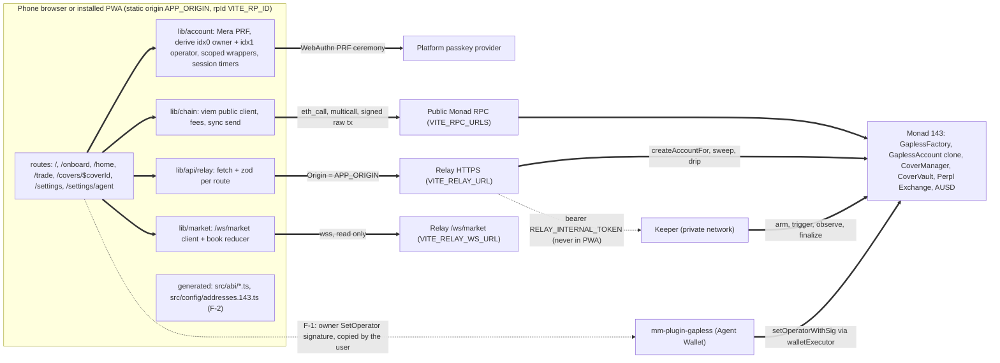
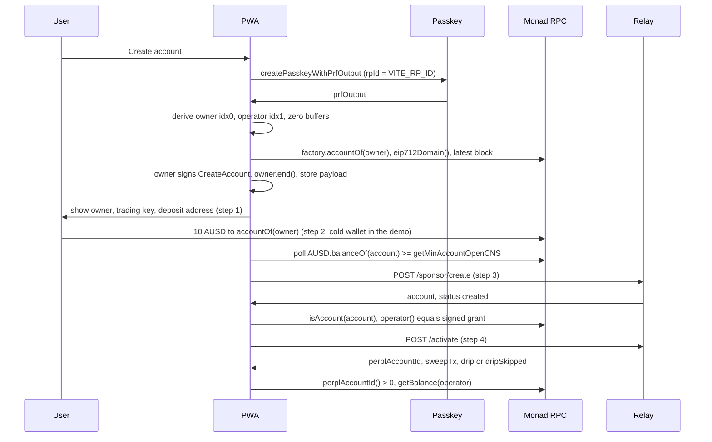

# Gapless PWA architecture (web lane F)

Status: **Proposed**, 2026-10-07 (WIB). Author: architect. Implementers: frontend-designer, frontend-engineer, devops-engineer (F-2 producer side), backend-engineer B1 (one optional relay change, ADR-W6).
Authority order: `BUILD_PLAN.md` section 0, `gapless/00_GAPLESS_TECH_SPEC.md` section 5, `contract/INTERFACES.md`, then this file. Where this file deviates from BUILD_PLAN W9 it says so.
Notation: CLI flags are written `flag:name` (a double-hyphen flag) so this file never contains a double hyphen.

## 0. Summary

The PWA is a static SPA on one fixed HTTPS host. It is the user's only account layer: a Mera passkey yields two secp256k1 keys in page memory, **owner** (`m/44'/60'/0'/0/0`) and **operator** (`m/44'/60'/0'/0/1`). The owner signs typed data only (`CreateAccount`, `SetOperator`, `Withdraw`) and never needs MON. The operator sends every transaction (trade, cover, cancel, relay of owner signatures) from MON dripped by the relay. Reads go to a public Monad RPC through viem, market data comes from the relay's `/ws/market`, and the relay sponsors account creation and activation. No backend ever receives a private key: the relay only receives the operator **address** inside the signed grant.

What exists today: `web/` is the unmodified Kwek Labs starter (TanStack Start with SSR and Nitro, HeroUI 2.8.x, GSAP, Lenis, faker, an inline theme script). No wallet library is present or half-integrated: no viem, wagmi, ethers or `window.ethereum` anywhere in `web/src` or `web/package.json`, and `node_modules` is not installed. `web/src/abi/` and `web/src/config/addresses.143.ts` do not exist; `scripts/sync-abi.ts` currently skips `web/` and **throws** if `web/src/abi` appears before render rules are added (F-2, section 6).

## 1. Docs verified for this plan (2026-10-07)

| Topic               | Fact relied on                                                                                                                                                                                                                                                                                     | Source                                                                                              |
| :------------------ | :------------------------------------------------------------------------------------------------------------------------------------------------------------------------------------------------------------------------------------------------------------------------------------------------- | :-------------------------------------------------------------------------------------------------- |
| Mera on web         | The Monad Mera guide targets browsers; React Native is a separate recipe. Install `@category-labs/mera viem @scure/bip32 @scure/bip39`; path `m/44'/60'/0'/0/${index}`; HTTPS or localhost; passkey tied to `rpId`; provider must support WebAuthn PRF; two session patterns (hold, prompt per tx) | https://docs.monad.xyz/guides/mera                                                                  |
| Mera authenticators | PRF works: iCloud Keychain (iOS 18+, macOS 15+), Google Password Manager (Android, signed-in desktop Chrome), Windows 11 25H2+, 1Password, Proton Pass, YubiKey 5. Fails: desktop Chrome local profile, Bitwarden, Dashlane. No statement on Home Screen PWAs or in-app browsers                   | https://mera.category.xyz/authenticator-support/                                                    |
| Mera API            | `createPasskeyWithPrfOutput`, `getPasskeyPrfOutput`, `createSecp256k1SigningSession` (`end()` zeroes), `toViemAccount` from `@category-labs/mera/viem`, `isMeraError` codes `PRF_UNAVAILABLE`, `PASSKEY_OPERATION_FAILED`, `CRYPTO_UNAVAILABLE`, `SESSION_ENDED`                                   | `gapless/03_mera_agora_frontend_reference.md` section 1.3 (0.2.0 tarball typings)                   |
| npm today           | `@category-labs/mera` 0.2.0 (only release), `viem` 2.57.3, `@scure/bip32` 2.4.0, `@scure/bip39` 2.4.0, `@heroui/react` 3.2.6 latest, `@tanstack/react-start` 1.168.60, `@tanstack/react-router` 1.170.41, `serwist` and `@serwist/vite` 9.5.13, `uqr` 0.1.3 (zero dependencies)                    | `npm view`                                                                                          |
| TanStack Start SPA  | `tanstackStart({ spa: { enabled: true } })`; prerendered shell `/_shell.html`; host rewrite `/* /_shell.html 200`                                                                                                                                                                                  | https://tanstack.com/start/latest/docs/framework/react/guide/spa-mode                               |
| PWA install         | Chrome install criteria: manifest `name` or `short_name`, 192 and 512 icons, `start_url`, `display` standalone (or similar), HTTPS, engagement. No service worker requirement listed                                                                                                               | https://web.dev/articles/install-criteria                                                           |
| viem                | `writeContractSync` returns the receipt via `sendTransactionSync`, accepts local accounts, has `timeout` and `throwOnReceiptRevert`; `signTypedData` takes `domain, types, primaryType, message` with bigint integers                                                                              | https://viem.sh/docs/contract/writeContractSync , https://viem.sh/docs/actions/wallet/signTypedData |
| uqr                 | `encode()` returns `{ data: boolean[][], version, size }`; ESM, zero dependency                                                                                                                                                                                                                    | https://github.com/unjs/uqr                                                                         |

## 2. Component diagram



### Components

| Component                                  | Responsibility                                                                                                                                         | Agent                                                   | Tech                                                                              |
| :----------------------------------------- | :----------------------------------------------------------------------------------------------------------------------------------------------------- | :------------------------------------------------------ | :-------------------------------------------------------------------------------- |
| Shell and routing                          | SPA shell, file routes, headers, manifest, pause banner                                                                                                | frontend-engineer                                       | TanStack Start SPA mode, TanStack Router, Tailwind 4, HeroUI (ADR-W3)             |
| Design system                              | DESIGN.md pick, tokens, trading and stepper components                                                                                                 | frontend-designer                                       | per `.claude/agents/frontend-designer`                                            |
| `lib/account`                              | Passkey ceremonies, key derivation and zeroing, owner and operator scope wrappers, idle and hidden session end, typed-data builders with domain checks | frontend-engineer                                       | `@category-labs/mera` 0.2.0, `@scure/bip32` and `@scure/bip39` 2.4.0, viem 2.57.3 |
| `lib/chain`                                | One viem public client (`viem/chains` `monad`), multicall reads, fee policy, gas rule, `writeContractSync` sends, revert decoding                      | frontend-engineer                                       | viem 2.57.3                                                                       |
| `lib/api/relay`                            | Typed client for the relay routes in section 5, zod response schemas, timeouts and retry rules                                                         | frontend-engineer                                       | fetch, zod 4                                                                      |
| `lib/market`                               | `/ws/market` socket, keepalive, status and snapshot handling, L2 book reducer, reconnect                                                               | frontend-engineer                                       | browser WebSocket                                                                 |
| Generated ABIs and addresses (F-2)         | `web/src/abi/*.ts`, `web/src/config/addresses.143.ts` from `contract/abi` and `deployments/143.json`                                                   | devops-engineer (render rules in `scripts/sync-abi.ts`) | bun                                                                               |
| Relay sigma eligibility (ADR-W6, optional) | Let a sponsored account with an activated Perpl account but no position request `/sigma-refresh`                                                       | backend-engineer B1                                     | Fastify route `routes/sigmaRefresh.ts`                                            |

## 3. Architecture decisions

### ADR-W1 Wallet layer: Mera passkey on web, owner and operator split (Accepted)

**Context.** RUNBOOK section 10 step 1 is "Mera create; the PWA shows the owner EOA and its session key". The Agora bounty card says "authenticating via Mera"; the Mera UX card says "No seed phrase. No wallet extension. No custody backend". The contracts expect an EOA owner: `createAccountFor` checks the signature with OZ `SignatureChecker`, and the relay refuses owners with code (`OWNER_NOT_EOA`). The hackathon notes say Mera "primarily targets React Native"; the Monad guide verified today says the opposite (web-first, RN as a separate recipe).
**Decision.** Mera 0.2.0 in the browser is the only signer. One PRF output becomes 24-word BIP-39 entropy, then the seed, then `m/44'/60'/0'/0/0` (owner) and `/1` (operator), exactly as `03_mera_agora_frontend_reference.md` section 1.8 specifies and as Mera's own docs do (import `@scure/bip39/wordlists/english.js` with the `.js` suffix). Every intermediate buffer we own is zeroed. Owner and operator are `Secp256k1SigningSession`s wrapped by `toViemAccount`, then by our scope wrappers (section 8.3). No injected provider, no wagmi, no connector library. The page never reads `window.ethereum`.
**Consequences.** Desktop Chrome without Google Password Manager returns `PRF_UNAVAILABLE`, so judges on such machines need the hybrid QR path (phone) or the read-only pages. In-app browsers (Telegram and similar) are detected and redirected to Safari or Chrome before any ceremony. Passkeys are bound to `VITE_RP_ID` forever (open question Q1).
**Alternatives.** (a) Injected EOA (MetaMask, Rabby): fails both Mera-gated bounties and adds a wallet extension. Rejected for the product; not even as a dev fallback, because a second signer path doubles the audit surface. (b) WebAuthn P-256 smart account via the `0x0100` precompile: needs a new account contract and an ERC-1271 owner, which the relay refuses. Rejected. (c) Mera on React Native (Expo dev build): no time before Oct 12; the same derivation makes a later native app reach the same accounts. Deferred.

### ADR-W2 SPA mode on a static host; relay on its own origin (Accepted)

**Context.** The starter renders on a Nitro server. Key state must never be server-rendered or hydrated, CSP needs fixed script hashes, and the relay's per-IP limits need the real client IP.
**Decision.** Enable TanStack Start SPA mode, remove Nitro and every server function, host the static build with `/* /_shell.html 200`. The PWA calls the relay directly on its own origin with CORS (the relay already allows exactly `APP_ORIGIN`, GET and POST, `Content-Type` only, no credentials).
**Alternatives.** Same-origin proxy from the static host to the relay: simpler CSP, but the relay would see the host's egress IPs, and `TRUST_PROXY` rejects CIDRs wider than /8, so per-IP caps would collapse into one bucket. Rejected.

### ADR-W3 Keep the starter's installed majors for the hackathon (Proposed, frontend-designer may flip in its first session)

**Context.** BUILD_PLAN W9 pins HeroUI v3 3.2.6, Vite 8 and React 19.3. The starter ships HeroUI 2.8.x, Vite 7, React 19.2. No Gapless component exists yet, so a switch now costs little, but every hour counts before the Thu demo.
**Decision.** Stay on the starter's majors unless frontend-designer, after reading the HeroUI v3 docs, chooses v3 before any component is built. Either way: pin exact versions in `package.json`, commit `bun.lock`, install frozen in CI. Drop from the starter: Nitro, SSR, `@faker-js/faker`, `buffer` and `src/lib/polyfills.ts` (viem does not need it), `@tanstack/react-table` if unused, Lenis (it hijacks touch scrolling in book lists and sheets), the inline theme script in `__root.tsx` (dark is fixed: put `className="dark"` on `<html>`), and devtools outside `import.meta.env.DEV`. GSAP stays only if the landing uses it.

### ADR-W4 One-ceremony onboarding: sign at create, submit when funded (Accepted)

**Context.** The relay requires fund-first (`/sponsor/create` answers 409 `NOT_FUNDED` until `accountOf(owner)` holds `getMinAccountOpenCNS`, 10 AUSD). RUNBOOK step 1 also requires the operator to set `SPONSOR_DEMO_OWNER` and `DRIP_ALLOWLIST` and restart the relay before steps 3 and 4. Re-prompting for the passkey at step 3 costs a ceremony (Mera UX bounty counts prompts).
**Decision.** At create (or the first sign-in with no deployed account) the owner signs `CreateAccount` immediately, then `owner.end()`. The signed payload `{owner, grant, deadline, sig}` is public data (it can only deploy the user's own account with the user's own operator; the relay adopts an identical front-run, SE2-L2), so it is kept in `localStorage` under one versioned key. The onboarding screen polls the deposit balance and submits `/sponsor/create` when funded, then `/activate`.
Timing rules (relay checks at submit time, contract checks `block.timestamp`): use the latest block timestamp as "now", not the device clock. Grant `expiry = now + 21,540 s` (6 h minus a 60 s margin; relay max `SPONSOR_GRANT_MAX_TTL_S` 21,600, min now + 600). `deadline = now + 82,800 s` (23 h; relay window is now + 60 s to now + 86,400 s). The stored payload is usable while `expiry >= submitTime + 3,600` (at least 1 h of trading left); otherwise discard it and ask for one fresh ceremony to re-sign.
**Consequences.** A user who clears storage before funding re-signs once (stateless test still holds: the same passkey gives the same owner, operator and `accountOf`).

### ADR-W5 Pricing: probe for open-and-cover, `quote()` for an existing position (Accepted)

**Context.** `CoverManager.quote(account, p)` reverts `LotsExceedPosition(lots, 0)` when the account has no position (`CoverManager.sol` `_quote`, line 532). RUNBOOK step 5 says "the PWA quotes first", then `tradeAndCover`.
**Decision.** Same method as the plugin (`plugin/src/lib/cover.ts` `probeOpenPremium`): `eth_call` `account.tradeAndCover(desc, p, 0)` from the operator; the account reverts `PremiumTooHigh(quotedCNS, 0)` and `quotedCNS` is the exact escrow plus rent after the trade. Any other revert is a real blocker and is shown (`StopTooClose(distanceBps, minBps)` gives the minimum distance, `SigmaStale`, `MarkStale`, `CoverShareExceeded`, `NotionalTooLarge`, `EnforcedPause`, `MarketPaused`, `OperatorBudgetExceeded`, `NotionalCapExceeded`, `LimitOffMarket`). `maxPremiumCNS = quoted + floor(quoted x 200 / 10,000)`. Cap is exact client-side (`floor(lots x stopPNS x scale x maxGapBps / 10,000)`), expiry is `head + durationBlocks`, warm-up is `marketParams.warmupBlocks`. The escrow and rent split is not available before the trade; the screen shows the total, Cap, expiry, warm-up and the rent floor (`minFeeCNS x ceil(T / 12,000)`, non-refundable), and `/covers/$coverId` shows the exact split from `CoverBought`. When a position already exists (`buyCover` path), `quote()` gives every field.
**Alternatives.** Port `backend/src/jobs/premium.ts` (contract-parity math) for a pre-trade split: duplicate pricing code across packages without a shared workspace (ADR-P1). Deferred. Trade first, then quote, then `buyCover`: two transactions and an uncovered position meanwhile. Used only as the ADR-W6 fallback.

### ADR-W6 Sigma bootstrap for a first trade (Proposed, needs a user decision: Q4)

**Context.** Quotes revert `SigmaStale` once `block.number - postedBlock > sigmaMaxAgeBlocks` (6,000 blocks, about 30 min at 0.30 s). The keeper posts sigma only on demand from `/sigma-refresh`, and the relay accepts a refresh only for an account with an **open position** on that perp (`routes/sigmaRefresh.ts` `eligible()` checks `getPosition(...).lotLNS > 0`). `tradeAndCover` checks sigma before any position exists, so a fresh account can never unblock its own first quote. Memory `spec_gap_analysis_2026-10-07.md`: sigma has been stale since block 111,105,484.
**Decision (recommended).** backend-engineer B1 relaxes eligibility to: `isAccount`, `perplAccountId > 0`, and (allowlist mode) a relay create row for its owner. The per-account daily cap, the 60 s per-perp slot, and the keeper's 12 posts per UTC day all stay. Needs a short security-auditor look (SE-W4 scope). The PWA then calls `/sigma-refresh` whenever `sigmaOf(1)` is stale or within 10% of `sigmaMaxAgeBlocks`, waits for `SigmaPosted` (poll `sigmaOf`), and probes again.
**Fallback (no backend change).** On `SigmaStale` with no position: send `trade` (IOC open only), call `/sigma-refresh`, wait for the post, `quote()`, then `buyCover`. Two operator transactions; the position is uncovered for about a minute. The UI must say so before the user confirms.
**Also required either way:** the keeper must be running (key rotation pending) or `/sigma-refresh` returns 503 `KEEPER_UNAVAILABLE` and no cover can arm or trigger.

### ADR-W7 Cover history from chain plus keeper console, no GraphQL dependency (Accepted)

**Context.** The Envio indexer is built but not deployed to Cloud (memory `indexer_w1_2026-10-06.md`). `rpc.monad.xyz` caps `eth_getLogs` at 100 blocks.
**Decision.** `/covers/$coverId` polls `getCover(id)` (status, blocks, amounts). Event tx hashes come from single-block `eth_getLogs` at blocks the struct already records (`startBlock` for `CoverBought`, `armedBlock` for `Armed`, `triggerBlock` for `Triggered`), filtered by the manager address and `topic1 = coverId`. `Observed` and `Finalized` hashes come from `GET /api/keeper/console` `recent[]` (matches on `coverId`), with a bounded fallback scan of 100-block windows forward from `triggerBlock` (at most 10 windows). `VITE_ENVIO_GRAPHQL_URL` becomes an optional enhancement once the indexer is live.

### ADR-W8 Installability from the manifest; service worker later (Accepted)

**Context.** Agora requires an installable mobile app. Chrome's install criteria list no service worker requirement. A compromised `sw.js` is persistent XSS.
**Decision.** P0 ships `manifest.webmanifest` (name, short_name, 192, 512 and maskable icons, `start_url` "/", `scope` "/", `display` standalone, `orientation` portrait, dark colors) plus `apple-touch-icon` and `apple-mobile-web-app-capable` in the root head. Serwist precache-only with `NetworkOnly` for every cross-origin request is P2, served with `Cache-Control: no-cache`.

### ADR-W9 Addresses and ABIs only from generated files; the relay is never a source of anything signed (Accepted)

**Decision.** Contract addresses come only from `src/config/addresses.143.ts` and ABIs only from `src/abi/*.ts`, both written by `scripts/sync-abi.ts` (F-2). Per-user addresses come from chain reads (`accountOf(owner)`, `operator()`). Relay responses are display data: the `account` returned by `/sponsor/create` must equal `factory.accountOf(owner)` or the flow stops. Before any typed-data signature, the PWA reads `eip712Domain()` from the verifying contract and checks name, version, chain id 143 and address (same check as the relay boot and the plugin's `domainOf`).

### ADR-W10 F-1 "owner grants agent": the PWA signs, the plugin submits (Accepted)

See section 7. The PWA never submits the agent's `setOperatorWithSig`, so every agent-side transaction stays inside Agent Wallet policy (ADR-P6, MetaMask bounty rule "every tx through Agent Wallet").

## 4. Route map (TanStack Router, file-based, `src/routes/`)

| File                  | Path               | RUNBOOK 10 step | Priority                 | Content                                                                                                                                                                                                                                                                                                   |
| :-------------------- | :----------------- | :-------------- | :----------------------- | :-------------------------------------------------------------------------------------------------------------------------------------------------------------------------------------------------------------------------------------------------------------------------------------------------------- |
| `__root.tsx`          | layout             | all             | P0                       | Shell, head (manifest, icons, theme color), providers (QueryClient, session), global pause banner from `paused()`, `marketPaused(1)`, Exchange `isHalted()` and relay `SPONSOR_DISABLED`                                                                                                                  |
| `index.tsx`           | `/`                | 1               | P0                       | Landing: "Create account" and "Sign in" as separate buttons (a second create makes a second, unrelated account), in-app browser detector, PRF preflight via `PublicKeyCredential.getClientCapabilities?.()` (`extension:prf`) when present; read-only links for judges                                    |
| `onboard.tsx`         | `/onboard`         | 1 to 4          | P0                       | Resumable state machine derived from chain state (section 5.1): Keys (show owner EOA and trading key with copy buttons, required by step 1), Fund (deposit address `accountOf(owner)` with QR and live AUSD balance), Create (`/sponsor/create`), Activate (`/activate`, drip result), Ready              |
| `home.tsx`            | `/home`            | 4               | P0 minimal, P1 full      | Balance = wallet AUSD + Perpl free `balanceCNS` + position `depositCNS` (one multicall), deposit address, session chip (operator expiry, per trade cap, budget left), active cover card linking to `/covers/$coverId`, "fund your trading key with MON" card when the drip was skipped                    |
| `trade.tsx`           | `/trade`           | 5               | P0                       | BTC-PERP (perpId 1), side, size in lots and AUSD, leverage, live book and mark from `/ws/market`, stop input, Guarantee toggle with the ADR-W5 quote, risk sheet, simulate then `tradeAndCover`, receipt with MonadVision link, then navigate to the cover                                                |
| `covers/$coverId.tsx` | `/covers/$coverId` | 6, 7            | P0                       | Stepper Live, Armed (block), Triggered (block, paid now, owed), Observed, Finalized (top-up, total), or end states Cancelled, Expired, Voided with `EndReason`; arm-to-trigger block delta; "finalizing" until the block is finalized; all tx hashes; cancel button (P1) with the M-03 escrow rule stated |
| `settings/index.tsx`  | `/settings`        | 13 (recovery)   | P1                       | Session (operator key, expiry, caps, `operatorUsage()`), renew this device's operator (owner step-up, section 7.3), close position, withdraw (owner signs `Withdraw`, operator relays `withdrawWithSig`), export phrase (P2)                                                                              |
| `settings/agent.tsx`  | `/settings/agent`  | F-1             | P0b (gates W3c)          | Owner "Grant agent" flow, section 7                                                                                                                                                                                                                                                                       |
| `vault.tsx`           | `/vault`           | none            | P1 read-only, P2 actions | TVL, utilization, reserved, max-loss disclosure (BUILD_PLAN Must; not on the demo path)                                                                                                                                                                                                                   |

Route params: `$coverId` must match `^0x[0-9a-fA-F]{64}$` (validate in the route's `params.parse`, 404 otherwise). No route accepts a redirect target in search params. Routes that need a session render an unlock card in place instead of redirecting. `/gap-index`, `/gap-index/wallet/$addr` and `/stats` belong to W10 (analytics) and are out of scope here; they reuse `lib/api/relay`.

Proposed source layout (starter conventions: `lib/` for integrations, no barrel files, `@/` alias):

```text
src/abi/<Name>.ts                 generated (F-2), never edited
src/config/addresses.143.ts       generated (F-2), never edited
src/config.ts                     app constants: grant defaults, gas rule, demo defaults, explorer base
src/env.ts                        client-only VITE_ schema (section 9.1)
src/lib/chain.ts                  public client, fee policy, send helper, revert decoding
src/lib/account/keys.ts           Mera create and unlock, derivation, assertPasskeyOrigin
src/lib/account/scoped.ts         operator and owner scope wrappers
src/lib/account/session.ts        in-memory session holder, idle and hidden timers
src/lib/account/typedData.ts      CreateAccount, SetOperator, Withdraw builders + domain checks
src/lib/api/relay.ts              relay client + zod schemas
src/lib/market/ws.ts              /ws/market client + book reducer
src/lib/errors.ts                 Mera, relay and revert error copy
src/hooks/useAccountState.ts      onboarding state from chain reads
src/utils/units.ts                CNS, PNS, LNS formatting and parsing
```

## 5. Data flow per page

Response envelope for every relay HTTP route (`backend/src/lib/http.ts`): `{ success: true, data, error: null }` or `{ success: false, data: null, error: { code, message, requestId, details? } }`. The PWA validates `data` with a zod schema per route and maps `error.code`, never `message`, to copy. Integers in relay JSON are decimal strings unless noted.

### 5.1 `/onboard` (RUNBOOK steps 1 to 4)



State derivation (`useAccountState`), evaluated top to bottom from one multicall, so a reload or a fresh device resumes at the right step:

| Condition                                                                                | Step shown                                                                        |
| :--------------------------------------------------------------------------------------- | :-------------------------------------------------------------------------------- |
| No session                                                                               | Create or Sign in                                                                 |
| `isAccount(accountOf(owner))` false and AUSD balance < `getMinAccountOpenCNS()`          | Fund                                                                              |
| not deployed, funded                                                                     | Create (submit the stored payload, or re-sign per ADR-W4)                         |
| deployed, `perplAccountId() == 0` or operator MON balance is 0 and no drip skip recorded | Activate                                                                          |
| deployed, `operator().key != operator address`                                           | Operator replaced (agent linked, or another device): offer re-grant (section 7.3) |
| deployed, `operator().expiry <= now`                                                     | Session expired: renew (section 7.3)                                              |
| otherwise                                                                                | Ready: go to `/trade`                                                             |

Chain reads: `GaplessFactory.accountOf(owner)`, `isAccount(account)`, `eip712Domain()`; `AUSD.balanceOf(account)`; `PerplExchange.getMinAccountOpenCNS()`; `GaplessAccount.perplAccountId()`, `operator()`, `owner()`; `eth_getBalance(operator)`.

**`POST /sponsor/create`** (`backend/src/relay/routes/sponsor.ts`, service `sponsor/service.ts`). Rate 6 per minute per IP plus day caps; handler timeout 35 s, so the client timeout is 40 s and a timed-out call is retried (idempotent by owner: the stored result is returned).

|            | Shape                                                                                                                                                                                                                                                                                                                           |
| :--------- | :------------------------------------------------------------------------------------------------------------------------------------------------------------------------------------------------------------------------------------------------------------------------------------------------------------------------------ |
| Request    | `{ owner: address, grant: { key: address, expiry: "<uint64>", maxNotionalPerTradeCNS: "<uint128>", maxNotionalPerDayCNS: "<uint128>" }, deadline: "<uint256>", sig: "0x" + 130 hex }` (strict object, unknown keys are 400)                                                                                                     |
| 200 `data` | `{ owner, account, status: "created" or "pending", txHash: hex or null, blockNumber: string or null }`                                                                                                                                                                                                                          |
| Errors     | 400 `VALIDATION_ERROR`, `SIG_EXPIRED`, `DEADLINE_TOO_FAR`, `GRANT_OUT_OF_POLICY`, `BAD_SIGNATURE`, `OWNER_NOT_EOA`, `WOULD_REVERT`; 403 `NOT_ALLOWLISTED`; 409 `NOT_FUNDED`, `IN_PROGRESS`, `CREATE_FAILED`, `ACCOUNT_EXISTS`; 429 `SPONSOR_CAP`; 502 `CREATE_FAILED`; 503 `SPONSOR_DISABLED`, `BUDGET_EXHAUSTED`, `RELAY_BUSY` |

`pending` and `RELAY_BUSY`: poll `isAccount` and retry after 3 s. `NOT_ALLOWLISTED`: "Gapless is invite-only during the canary", showing the owner address to send to the team. `ACCOUNT_EXISTS` with `owner()` equal to ours: treat as created.

**`POST /activate`**: same limits.

|                      | Shape                                                                                                                                                                                                 |
| :------------------- | :---------------------------------------------------------------------------------------------------------------------------------------------------------------------------------------------------- |
| Request              | `{ account: address }`                                                                                                                                                                                |
| 200 `data`           | `{ account, perplAccountId: string or null, sweepTx: string or null, drip: { to, wei, txHash, blockNumber } or null, dripSkipped: string or null }`                                                   |
| `dripSkipped` values | `disabled`, `no_operator`, `operator_expired`, `operator_no_budget`, `not_allowlisted`, `already_funded`, `drip_reverted` (the first six reopen on the next call)                                     |
| Errors               | 404 `NOT_AN_ACCOUNT`; 403 `NOT_SPONSORED`; 409 `IN_PROGRESS`, `ACTIVATION_FAILED`, `NOT_FUNDED`; 429 `SPONSOR_CAP`; 502 `ACTIVATION_FAILED`; 503 `RELAY_BUSY`, `BUDGET_EXHAUSTED`, `SPONSOR_DISABLED` |

The relay returns after the drip receipt plus 3 blocks, so the operator can send immediately after a 200 with `drip`.

### 5.2 `/trade` (RUNBOOK step 5)

Demo defaults (RUNBOOK 10.5, CANARY_PARAMS): BTC perpId 1, 22 lots (one lot is 1e-5 BTC), leverage 3x (`leverageHdths` 300), stop about 50 bps under mark and never closer than `max(minDistanceBps, 15 bps)`, `maxGapBps` 200, `durationBlocks` 12,000. Inputs are editable within `marketParams` bounds.

Chain reads (one multicall, refreshed on each new head shown or every 2 s while the form is open): `CoverManager.marketConfig(1)` (priceDecimals, lotDecimals, scale), `marketParams(1)` (minStopDistanceBps, maxGapBpsCap, min and max duration, warmupBlocks, maxCoverNotionalCNS, sigmaMaxAgeBlocks, minFeeCNS), `sigmaOf(1)`, `paused()`, `marketPaused(1)`, `activeCoverOf(account, 1)`, `isLocked(account, 1)`; `PerplExchange.getPerpetualInfo(1)` (markPNS, markTimestamp, `maxBidPriceONS` best bid, `minAskPriceONS` best ask, status), `isHalted()`, `getPosition(1, perplAccountId)`; `GaplessAccount.operator()`, `operatorUsage()`.

Order recipe (same as the plugin, `plugin/src/lib/cover.ts`): `orderType` 0 long or 1 short, IOC, `maxMatches` 32, `maxNegPnlCollatBPS` 300, `lastExecutionBlock` 0, `expiryBlock` 0, limit = best opposite onchain price x (1 +/- 50 bps), refused unless within 500 bps of the onchain mark (contract M-01). The limit and mark always come from chain reads, never from the WebSocket.

Pre-send checks, each with its own message: buys not paused; venue up; sigma fresh (else ADR-W6); notional `<= operator().maxNotionalPerTradeCNS`; `operatorUsage().availableCNS` covers trade notional plus cover notional (a 22-lot `tradeAndCover` charges about 37.9 AUSD of the 100 AUSD day, so two per day); no active cover on the perp.

Send: probe (ADR-W5), then `estimateGas` from the operator, `gas = ceil(estimate x 1.2)` refused above 5,000,000 (Monad bills the limit), `maxPriorityFeePerGas` 2 gwei, `maxFeePerGas = baseFee x 2 + 2 gwei` (backend fee policy), `writeContractSync` with `throwOnReceiptRevert`, then decode `CoverBought` from the receipt logs (manager address, `coverId` topic) and navigate. Budget note: the 0.5 MON drip at a 202 gwei max fee allows a gas limit up to about 2.47M per send; show the operator's MON balance next to the button.

**`POST /sigma-refresh`** (`routes/sigmaRefresh.ts`): 10 per minute per IP.

|            | Shape                                                                                                                                                          |
| :--------- | :------------------------------------------------------------------------------------------------------------------------------------------------------------- |
| Request    | `{ perpId: 1, account: address }` (`perpId` is a JSON **number**)                                                                                              |
| 202 `data` | `{ queued: true }`                                                                                                                                             |
| Errors     | 403 `NOT_ELIGIBLE`; 429 `RATE_LIMITED` (honor `Retry-After`), `SIGMA_REFRESH_CAP`; 404 `UNKNOWN_MARKET`; 503 `SIGMA_REFRESH_UNAVAILABLE`, `KEEPER_UNAVAILABLE` |

**Real-time: `/ws/market`** (`backend/src/relay/ws/marketServer.ts`, wire format in `backend/CLAUDE.md` "Relay market data"). Display only.

- URL `VITE_RELAY_WS_URL` (the relay's `WS_PORT` listener routed to path `/ws/market` by the reverse proxy). Origin must equal `APP_ORIGIN`; at most 5 sockets per client and 20 upgrades per minute.
- On open: a status frame `{"mt":9000,"status":"up" or "partial" or "down","t":ms,"missing"?:[...]}`, then the snapshot in Perpl wire format (`mt` 6 subscription with `sid` per stream, 100 heartbeat, 9 market state, 15 book snapshot, 17 trades snapshot), then upstream frames byte for byte (9, 16 book update, 18 trades update, 100).
- Book frames carry `sid`, not the market id: map `sid` to `order-book@1` and `trades@1` from the `mt` 6 frame. Levels `{p, s, o}`; `o: 0` removes the level; `sn` is the block number. Market state `d["1"]` has `mrk, orl, lst, mid, bid, ask` as Perpl-scaled numbers (divide by `10^priceDecimals`).
- Client keepalive: send `{"mt":1,"t":<ms>}` every 30 s (the relay closes after 90 s without a client frame; more than 60 frames per minute closes with 1008). Expect `{"mt":2,"t":...}` back.
- On status `down` or a heartbeat `sn` gap: mark book, trades and price unsynced (grey them out), keep the socket, resume on the next `mt` 6 and snapshots. Close 1001 (recycled about every 30 min): reconnect at once. Close 1008: back off 16 s. Other closes: 1 s doubling to 30 s with jitter. Reconnect on `visibilitychange` to visible and on `online` (iOS suspends background sockets).
- REST fallback while the socket is down: `GET /api/perpl/ticker/1` and `GET /api/perpl/book/1?levels=20` (60 per minute per IP across `/api/perpl/*`; `data` is Perpl's body plus `stale` and `ageMs`; validate only the fields used).

### 5.3 `/covers/$coverId` (RUNBOOK steps 6 and 7)

Chain reads: `CoverManager.getCover(coverId)` every 1 s while the status is non-terminal (Live 1, Armed 2, Triggered 3), every 10 s otherwise; `marketParams(1).windowBlocks` and `armTtlBlocks` for countdowns; `refundOwed(account)` for the claim banner; `getBlock("finalized")` to switch "finalizing" to "final". Logs per ADR-W7 (single-block `eth_getLogs` on the manager with `topic1 = coverId`). Status enum: 0 None, 1 Live, 2 Armed, 3 Triggered, 4 Finalized, 5 Cancelled, 6 Expired, 7 Voided.

**`GET /api/keeper/console`**: 30 per minute per IP, 2 s cache; poll every 5 s only while this page is visible.

|            | Shape                                                                                                                                                                                                                                                                                        |
| :--------- | :------------------------------------------------------------------------------------------------------------------------------------------------------------------------------------------------------------------------------------------------------------------------------------------- |
| 200 `data` | `{ schemaVersion: 1, status, head {block, lagBlocks}, signer {address, balanceWei}, governor {...}, markets [{perpId, gated, maxMatchesClose, liveCovers}], recent [{block, action, coverId?, txHash?, outcome, gasLimit}] (max 50), walks {...}, uptimeS }` (PARALLEL_BUILD_PLAN section 6) |
| Errors     | 503 `KEEPER_CONSOLE_DISABLED`, `KEEPER_UNAVAILABLE` (show "keeper status unavailable"; the stepper still works from chain reads)                                                                                                                                                             |

### 5.4 `/home`

Chain reads (one multicall): `AUSD.balanceOf(account)`, `PerplExchange.getAccountById(perplAccountId)` (`balanceCNS`, `lockedBalanceCNS`), `getPosition(1, perplAccountId)` (`depositCNS`, `lotLNS`, `pricePNS`, `pnlCNS`), `activeCoverOf(account, 1)`, `operator()`, `operatorUsage()`, `eth_getBalance(operator)`.
Relay (optional history list): `GET /api/wallet/:addr?limit=50` (20 per minute per IP) returns `{ address, accountId, window, limit, totals, positions[], ..., gapless: { account, owner, covers [{coverId, status, stopPNS, paidCNS, perpId}] } or null }`; 503 `WALLET_DATA_NOT_READY` and 404 `ACCOUNT_NOT_FOUND` render as empty history.

### 5.5 RPC

viem `createPublicClient({ chain: monad })` from `viem/chains` (id 143, Multicall3 `0xcA11...CA11`) with `fallback([...VITE_RPC_URLS.map(http)])`, `batch` on, `pollingInterval` set explicitly (viem's `blockTime` is 400 ms; real is about 300 ms). Public endpoints only: `https://rpc.monad.xyz` (25 rps, `eth_getLogs` 100 blocks) and `https://rpc1.monad.xyz` (15 rps). Never a tokenized or private URL in a `VITE_` variable (section 8.2). Sends use one endpoint at a time; a revert never fails over.

## 6. F-2 "import generated addresses" (definition)

F-2 means the PWA consumes ABIs and addresses that `scripts/sync-abi.ts` writes, with CI drift checks, instead of hand-typed values (ADR-P4, PARALLEL section 7: these paths are owned by the script, not by lane F). Two sides:

**Producer (devops-engineer, `scripts/**` owner, about 1 h, before any web code imports them):\*\*

1. Replace the `web/` skip-or-throw branch with render rules gated on `web/package.json` existing, mirroring the plugin branch.
2. `web/src/abi/<Name>.ts` for `IAUSD`, `ICoverManager`, `ICoverVault`, `IGaplessAccount`, `IGaplessFactory`, `IGaplessInherited`, `IPerplErrors`, `IPerplMin` (same set as the plugin: revert decoding needs `IGaplessInherited` for `EnforcedPause`, `IPerplErrors` for Perpl rejections, `ICoverVault` for vault errors bubbled through quotes). Export name `<Name>Abi`, `as const`. **No `index.ts`** (web convention: no barrel files; imports are `@/abi/ICoverManager`). Register `web/src/abi` as an owned directory so stray files fail `check`.
3. `web/src/config/addresses.143.ts` (single file; `web/src/config/` also holds the hand-written `animation.ts`, so the directory is not owned). Content contract:

| Export                                                   | Source in `deployments/143.json`          |
| :------------------------------------------------------- | :---------------------------------------- |
| `CHAIN_ID` (143)                                         | `chainId`                                 |
| `DEPLOY_BLOCK` (bigint)                                  | `deployBlock` (lower bound for log scans) |
| `LISTED_PERP_ID` (1)                                     | `listing.perpId`                          |
| `ADDRESSES.CoverManager`, `CoverVault`, `GaplessFactory` | `contracts.*.address`                     |
| `ADDRESSES.PerplExchange`, `AUSD`                        | `external.*`                              |

`GaplessAccountImpl`, `GaplessCreSink`, `BtcUsdFeed` and roles are not exported (the PWA never calls them). Header `// Generated by scripts/sync-abi.ts from deployments/143.json. Do not edit.`; quote and semicolon style should match `web/prettier.config.js` (single quotes, no semicolons) so the files look native, but formatting is not relied on (next point). 4. Add `src/abi/` and `src/config/addresses.143.ts` to `web/.prettierignore` and to the ESLint ignores. Otherwise `bun check` (`prettier write` plus `eslint fix`) rewrites generated files and `sync-abi check` fails in CI. 5. Tests in `scripts/test/` (render, owned-dir stale detection, gate) and the CI `sync` job unchanged.

**Consumer (frontend-engineer):** import only from these files; the CoverManager, factory and Exchange addresses are never read from env or the relay. Optional boot assertion in dev: `CoverManager.factory()` equals `ADDRESSES.GaplessFactory` and `EXCHANGE()` equals `ADDRESSES.PerplExchange`.

Current values (for review only, never hand-copied): CoverManager `0xb07C20cb5328d5208A1453521b94beeB3Faa1771`, GaplessFactory `0xB1a255e9D4CEdC20998ddC67a7Ec5e0B71bd8777`, CoverVault `0xab3CB7b3b28366eD7f6C59DbD2D708890919B289`, AUSD `0x00000000eFE302BEAA2b3e6e1b18d08D69a9012a`, PerplExchange `0x34B6552d57a35a1D042CcAe1951BD1C370112a6F`, deploy block 111,101,834.

## 7. F-1 "owner Grant agent" flow (definition)

**Purpose.** PARALLEL W3: the MetaMask Agent Wallet becomes the operator of the user's `GaplessAccount` through an owner-signed `SetOperator` grant, submitted by the plugin (`gapless:link`) through `walletExecutor`. W3c (mainnet agent demo) is blocked on this. Alternative for an EOA-owned test account: `cast wallet sign`, which does not apply to Mera owners because the owner key exists only behind the passkey.

### 7.1 Interface contract (from `IGaplessAccount.sol`, `GaplessAccount.sol` `setOperatorWithSig`, `plugin/src/ops/link.ts`)

| Item           | Value                                                                                                                                                                                                                                   |
| :------------- | :-------------------------------------------------------------------------------------------------------------------------------------------------------------------------------------------------------------------------------------- |
| Domain         | `{ name: "GaplessAccount", version: "1", chainId: 143, verifyingContract: <the user's clone> }`, checked against the clone's `eip712Domain()` before signing                                                                            |
| Type           | `SetOperator(address account,address key,uint64 expiry,uint128 maxNotional,uint128 maxNotionalPerDay,uint256 nonce,uint256 deadline)`                                                                                                   |
| Message        | `account` = clone; `key` = agent address; `expiry` (unix s); `maxNotional` = per trade CNS; `maxNotionalPerDay` = per day CNS; `nonce` = `account.opNonce()` read just before signing; `deadline` (unix s)                              |
| Submitted call | `setOperatorWithSig((key, expiry, maxNotionalPerTradeCNS, maxNotionalPerDayCNS), deadline, sig)` on the clone, by the agent                                                                                                             |
| Plugin command | `mm gapless link flag:account <clone> flag:expiry <abs unix> flag:deadline <abs unix> flag:max-per-trade <AUSD> flag:max-per-day <AUSD> flag:sig <0x...>` (absolute times required when a signature is given; amounts in AUSD decimals) |

### 7.2 Flow on `/settings/agent`

1. Precondition: account deployed and activated. Show the current operator, its expiry and `operatorUsage()`.
2. User pastes the agent address (from `mm` or the unsigned `gapless:link` output). Validate the checksum; refuse the owner address, the clone, the zero address and known contract addresses.
3. Limits form with defaults equal to the plugin's (`plugin/src/lib/config.ts`): 25 AUSD per trade, 100 AUSD per day, expiry now + 4 h, deadline now + 1 h. PWA hard bounds: per trade <= 25, per day <= 100, per trade <= per day, both nonzero, expiry <= now + 24 h, deadline <= now + 1 h ("now" from the latest block).
4. Plain-language confirmation: "This replaces this phone's trading key. Agent X can open and close BTC trades and guarantees up to 25 AUSD each and 100 AUSD per day until T. It can never withdraw. This phone stops trading until you re-grant it."
5. Fresh passkey ceremony (step-up), owner signs, `owner.end()` immediately.
6. Output: the signature and the full `mm gapless link ...` command with absolute values and a copy button, plus a QR of the command for laptop-to-phone transfer. Nothing is sent to the relay or any server.
7. Afterwards `/home` shows "Trading key: agent 0x...". The PWA operator is now dead onchain (one operator per account, ADR-P6 risk 7), and trade screens are disabled until 7.3.

Signature validity: one use; any `setOperator`, `revokeOperator`, `setOperatorWithSig` or `withdrawWithSig` bumps `opNonce` and invalidates it (`BadSig`). An unused signature lapses at `deadline`.

### 7.3 Re-grant this device (also renewal after expiry)

Same typed data with `key` = this device's operator address and the canary limits (25 AUSD, 100 AUSD, expiry now + 6 h). The owner signs after a fresh ceremony; the **operator** submits `setOperatorWithSig` itself (it has the drip MON; the owner has none). Allowed by the operator scope (section 8.3). Sequencing for the demo (PARALLEL risk 7): PWA trade demo first, agent link second, re-grant after.

## 8. Security considerations (frontend-engineer and security-auditor review before implementation)

### 8.1 Threat model

Derived keys are software keys in page memory. Any script in the page realm can sign with a live session, and script running during a ceremony can read the PRF output (Mera security model). So XSS is the critical risk. The onchain operator grant is the real boundary after a ceremony: an attacker holding only the operator can trade and buy covers inside 25 AUSD per trade, 100 per day, until expiry, and can never withdraw (withdrawals always pay the owner). The owner key is live only for one signature at a time.

### 8.2 Secrets never reach the client

- Every `VITE_` variable is compiled into public JavaScript. The web env schema has no secret fields: never `RELAY_INTERNAL_TOKEN`, `RELAY_KEY`, `KEEPER_KEY`, `ENVIO_API_TOKEN`, tokenized RPC URLs (`MONAD_HTTP_URLS`, `MONAD_WS_URL` with keys) or any API key. Remove `VITE_API_KEY` and `SERVER_URL` from the starter.
- Test: a vitest test fails if any key in the client env schema matches `/KEY|TOKEN|SECRET|PRIVATE|PASSWORD/i`; a post-build check greps `dist` for the relay token length pattern and known secret prefixes.
- The PWA never calls internal paths: the bearer-gated `/ws/market` pool, the keeper `/console` and `/healthz`, and `/sigma-refresh` on the keeper. It uses only the public relay routes in section 5.
- `web/.gitignore` misses `.env.development` and `.env.*`; the root `.gitignore` (`.env`, `.env.*`, `!.env.example`) covers it once the repo is initialized. `web/.env.example` still holds starter junk; the user replaces it by hand (hook-protected), with the names in 9.1 and no values.

### 8.3 Key handling

- **Never transmitted.** The relay contract needs only `owner` (address), `grant.key` (operator **address**), amounts, deadline and the owner's signature. No private key, seed, mnemonic or PRF output is ever serialized, logged, put in React state, sent to any URL, or stored. React context exposes addresses and signing functions only; keys live in a module closure in `lib/account/session.ts`.
- **Storage.** `localStorage` holds only the credential hint (`credentialId`, `transports`, validated on read) and the pending `CreateAccount` payload (ADR-W4). Nothing in `sessionStorage`, IndexedDB or cookies.
- **Lifetimes.** Owner: `end()` right after each signature. Operator: held while trading; `end()` after 15 min idle, 5 min hidden (`visibilitychange`), on sign-out, and on `pagehide`. After `end()`, viem rejects with `SESSION_ENDED`, which maps to "Session locked, unlock with your passkey".
- **Operator scope wrapper** (accident and UX boundary; the onchain grant is the security boundary): chain 143 only, value 0 only, no EIP-7702 authorization, no `signMessage`, no `signTypedData`, no raw `sign`. Transactions only to the user's clone with selectors `trade`, `tradeAndCover`, `buyCover`, `cancelCover`, `withdrawWithSig`, `setOperatorWithSig` (P2 adds `depositWithPermit`, vault `deposit`, `requestRedeem`, `claimRedeem`, AUSD `approve` to the vault, manager `claimRefund`).
- **Owner scope wrapper:** `signTypedData` only, only for primary types `CreateAccount` (domain = generated factory address) and `SetOperator` or `Withdraw` (domain = the user's clone from `accountOf(owner)`), chain id 143. Everything else throws. The owner never signs a transaction.
- **Signature format.** The relay and OZ ECDSA need 65 bytes, low s, v 27 or 28. A unit test asserts this on a Mera-signed `CreateAccount`.
- **Origin binding.** `assertPasskeyOrigin()` (`location.hostname === VITE_RP_ID`) before every ceremony, so preview deploys never mint passkeys. Use the exact app host as `rpId`, not an apex domain (a dangling subdomain under an apex rpId can run ceremonies).
- **Export phrase** (P2): only after a fresh ceremony, blurred until tapped, no automatic clipboard, cleared on hide.

### 8.4 XSS and CSP

- No `dangerouslySetInnerHTML` anywhere (delete the starter's inline theme script). React escaping only; relay, Perpl and chain strings render as text. The QR is drawn from `uqr` `encode()` data as JSX rects (its `renderSVG` returns a string; do not inject it).
- Zero third-party scripts, fonts, analytics or iframes on the app origin. Fonts are self-hosted (`@fontsource-variable/inter` is bundled, fine).
- Headers (static host), first as `Content-Security-Policy-Report-Only`, enforced before the public demo:

```text
Content-Security-Policy: default-src 'none'; script-src 'self' <sha256 hashes of the shell's inline scripts>; style-src 'self' 'unsafe-inline'; img-src 'self' data:; font-src 'self'; manifest-src 'self'; worker-src 'self'; connect-src 'self' https://rpc.monad.xyz https://rpc1.monad.xyz https://<relay host> wss://<relay host>; frame-src 'none'; frame-ancestors 'none'; object-src 'none'; base-uri 'none'; form-action 'none'; upgrade-insecure-requests
Permissions-Policy: publickey-credentials-create=(self), publickey-credentials-get=(self), camera=(), microphone=(), geolocation=(), payment=()
Cross-Origin-Opener-Policy: same-origin
X-Frame-Options: DENY
X-Content-Type-Options: nosniff
Referrer-Policy: no-referrer
Strict-Transport-Security: max-age=63072000; includeSubDomains
```

Script hashes are computed from `_shell.html` after each build (`03_mera_agora_frontend_reference.md` section 5.2 method) and substituted into the host's header file in the build step. `style-src 'unsafe-inline'` stays because HeroUI and motion set inline styles. Trusted Types only after testing.

- Supply chain: exact pins, committed `bun.lock`, frozen install in CI; review diffs of `@category-labs/mera`, `@noble/*`, `@scure/*` and `viem` on any bump. Mera declares `engines.node >= 24`; use Node 24 in CI.

### 8.5 Clickjacking and open redirects (pages that move funds)

- `frame-ancestors 'none'` plus `X-Frame-Options: DENY` on every path, so no signing or trade button can be overlaid.
- No route reads a redirect, `next` or `returnTo` parameter; post-action navigation targets are fixed internal paths. TanStack search params are zod-validated per route.
- External links are only to `https://monadvision.com/tx/<hash>` and `/address/<addr>` built from values that match `^0x[0-9a-fA-F]{64}$` or a checksummed address, with `rel="noopener noreferrer"`.
- Every value-moving action shows a confirmation sheet built from decoded calldata (function, perp, side, lots, limit, stop, max premium, gas limit and max MON cost), not from the form state alone.

### 8.6 Trust boundaries

| Boundary          | Trust                                  | Rule                                                                                                     |
| :---------------- | :------------------------------------- | :------------------------------------------------------------------------------------------------------- |
| Relay HTTP and WS | Untrusted for anything signed          | zod-validate responses; cross-check `account` and status against chain reads; WS prices are display only |
| Public RPC        | Trusted for reads, verified for writes | simulate before send; chain id 143 checked at startup; domain checks before typed data                   |
| Generated files   | Trusted (repo, CI drift check)         | only source of protocol addresses and ABIs                                                               |
| Device clock      | Untrusted                              | expiry and deadline from the latest block timestamp                                                      |

### 8.7 Failure modes

| Failure                                       | Behavior                                                                                              |
| :-------------------------------------------- | :---------------------------------------------------------------------------------------------------- |
| Buys paused (`EnforcedPause`, `MarketPaused`) | Banner; quote and trade disabled; covers keep their lifecycle (keeper still runs)                     |
| Relay down or `SPONSOR_DISABLED`              | Onboarding waits at Create or Activate with a retry; trading and covers still work (chain only)       |
| WS down                                       | Book greyed out "reconnecting"; REST fallback; trade still allowed (limit and mark from chain)        |
| Keeper down                                   | `/sigma-refresh` 503; cover stepper shows "keeper unavailable"; no new covers sold                    |
| `PRF_UNAVAILABLE`                             | Explain supported providers; offer "use your phone" (hybrid QR)                                       |
| Tab hidden on iOS                             | Sockets drop; on resume reconnect WS and refetch reads                                                |
| `writeContractSync` timeout                   | Show "submitted, confirming" with the hash; poll the receipt; never resend while a hash is unresolved |

## 9. Configuration

### 9.1 Web env (public, build time, `src/env.ts` client schema, all required unless noted)

| Name                     | Example                                        | Notes                                                                         |
| :----------------------- | :--------------------------------------------- | :---------------------------------------------------------------------------- |
| `VITE_RP_ID`             | `app.<domain>`                                 | Exact production host; permanent once passkeys exist (Q1). `localhost` in dev |
| `VITE_RELAY_URL`         | `https://relay.<domain>`                       | https only in production; must match CSP `connect-src`                        |
| `VITE_RELAY_WS_URL`      | `wss://relay.<domain>/ws/market`               |                                                                               |
| `VITE_RPC_URLS`          | `https://rpc.monad.xyz,https://rpc1.monad.xyz` | Public endpoints only; comma list                                             |
| `VITE_EXPLORER_URL`      | `https://monadvision.com`                      | Optional, default shown                                                       |
| `VITE_ENVIO_GRAPHQL_URL` |                                                | Optional, unused until the indexer is live (ADR-W7)                           |

Chain id and contract addresses are not env: they come from `addresses.143.ts`. Dev pairing: web dev server on port 3200 means relay `APP_ORIGIN=http://localhost:3200` with `NODE_ENV=development` (production requires https and a non-localhost origin).

### 9.2 Packages to add or remove in `web/package.json` (exact pins)

Add: `@category-labs/mera` 0.2.0, `viem` 2.57.3 (same pin as backend, plugin, indexer), `@scure/bip32` 2.4.0, `@scure/bip39` 2.4.0, `uqr` 0.1.3. P2: `serwist` and `@serwist/vite` 9.5.13. Remove: `nitro`, `@faker-js/faker`, `buffer`, `@tanstack/react-router-ssr-query`, `lenis` (ADR-W3), devtools from production bundles. No other wallet library.

### 9.3 App constants (`src/config.ts`)

Grant defaults 25 AUSD per trade, 100 AUSD per day, onboarding expiry 21,540 s, CreateAccount deadline 82,800 s; agent grant bounds (section 7.2); gas multiplier 1.2 and cap 5,000,000; fee policy (priority 2 gwei, max = base x 2 + 2 gwei); max premium slack 200 bps; open slippage 50 bps; demo trade defaults (section 5.2); session idle 15 min, hidden 5 min; WS ping 30 s.

## 10. Implementation order

| #   | Work                                                                                                                          | Agent                                 | Depends on                             | Est.     |
| :-- | :---------------------------------------------------------------------------------------------------------------------------- | :------------------------------------ | :------------------------------------- | :------- |
| 0   | Decide Q1 (domain and rpId), Q2 (host), Q3 (relay public URL and `APP_ORIGIN`), Q4 (sigma fix)                                | user                                  | none                                   |          |
| 1   | F-2 producer: web render rules in `scripts/sync-abi.ts`, prettier and eslint ignores, tests, run sync                         | devops-engineer                       | none                                   | 1 h      |
| 2   | DESIGN.md pick and tokens for onboarding, trade, stepper                                                                      | frontend-designer                     | none (parallel with 1)                 | 2 h      |
| 3   | SPA conversion, strip starter, env schema, manifest and icons, headers (Report-Only), host config with `/_shell.html` rewrite | frontend-engineer                     | 0 (host), 1                            | 2 to 3 h |
| 4   | `lib/chain`, `lib/api/relay`, `lib/account` (keys, scopes, session, typed data), `lib/errors`, with unit tests (section 11)   | frontend-engineer                     | 1, 3                                   | 4 to 5 h |
| 5   | `/` and `/onboard` (steps 1 to 4) on the live host; device pass 1                                                             | frontend-engineer, user               | 4, relay public with `SPONSOR_ENABLED` | 4 h      |
| 6   | ADR-W6 relay change (if chosen) plus tests and a security-auditor look                                                        | backend-engineer B1, security-auditor | Q4                                     | 1 to 2 h |
| 7   | `lib/market` WS client and `/trade` (probe, send)                                                                             | frontend-engineer                     | 4, 6 or the fallback                   | 6 h      |
| 8   | `/covers/$coverId`                                                                                                            | frontend-engineer                     | 4                                      | 3 h      |
| 9   | `/settings/agent` (F-1) and re-grant                                                                                          | frontend-engineer                     | 5                                      | 2 to 3 h |
| 10  | `/home`, `/settings` withdraw and close position, `/vault` read-only                                                          | frontend-engineer                     | 5, 7                                   | 4 h      |
| 11  | SE review of the PWA: CSP, key zeroing, scopes, env leakage, typed-data domain checks, error mapping                          | security-auditor                      | 5, 7, 9                                | 2 h      |
| 12  | CSP enforce, test-runner, code-reviewer, device pass 2 (stateless test)                                                       | test-runner, code-reviewer, user      | 11                                     |          |

Critical path: 1, 3, 4, 5, 7, plus the keeper running with the rotated key. PARALLEL's Thu 8 slot ("demo trade and cover on phone", "mainnet agent demo after F-1") assumes steps 5, 7 and 9 land Wednesday night to Thursday; if they slip, the plugin demo moves with F-1 (PARALLEL section 9 slip rule). Fallback for the demo trade if `/trade` slips: a flag-gated minimal form using the same operator session (BUILD_PLAN risk 5).

## 11. Test strategy

- **Unit (vitest, already in the starter):** key derivation from a fixed 32-byte PRF equals viem `mnemonicToAccount` at indexes 0 and 1, and buffers are zeroed; `CreateAccount` typehash, domain separator, digest and signature match the vector pinned in `backend/test/sponsor.test.ts` (fixture near line 290; copy the constants, do not import across packages); `SetOperator` digest matches a vector produced with the plugin's `SET_OPERATOR_TYPES`; signature is 65 bytes with low s and v 27 or 28; both scope wrappers allow and deny the listed cases; zod schemas accept recorded relay responses and reject extra or missing fields; WS reducer handles snapshot, diff, `o: 0`, `sn` gap and status `down`; revert decoding of `PremiumTooHigh`, `StopTooClose`, `SigmaStale`, `EnforcedPause`, `OperatorBudgetExceeded`; ADR-W4 timing rules; env schema has no secret-looking keys.
- **Integration (no mainnet writes from tests):** read-only calls against `rpc.monad.xyz` for `accountOf`, `eip712Domain`, `marketParams(1)`, `sigmaOf(1)`; the probe against a known deployed account once the demo account exists.
- **Manual device matrix:** iPhone Safari, iPhone Home Screen app, Android Chrome with GPM, desktop Chrome with GPM; record prompt count at create; stateless test (clear storage, sign in, same owner, same account, operator still registered).
- **Mainnet demo:** RUNBOOK section 10, screen-recorded.

## 12. Open questions for the user

| #   | Question                                                                                                                                                                                                         | Recommendation                                                                                                                                          | Needed by                              |
| :-- | :--------------------------------------------------------------------------------------------------------------------------------------------------------------------------------------------------------------- | :------------------------------------------------------------------------------------------------------------------------------------------------------ | :------------------------------------- |
| Q1  | Production domain and `VITE_RP_ID`. Passkeys bind to it forever; changing it orphans every account                                                                                                               | Buy or pick a custom domain now and use the exact host `app.<domain>`; avoid shared suffixes (`*.vercel.app`) because a project rename changes the host | Before the first real passkey (step 5) |
| Q2  | PWA host: Vercel (starter has `vercel.json`, headers via its `headers` config) or Cloudflare Pages (BUILD_PLAN decision 1, `_headers` and `_redirects`)                                                          | Either works for static SPA plus headers; pick the one where the domain from Q1 already lives. Change the rewrite to `/_shell.html` either way          | Step 3                                 |
| Q3  | Relay public URL, `APP_ORIGIN` and `TRUST_PROXY` for production (relay currently runs a local dev override with `APP_ORIGIN` localhost and `SPONSOR_ENABLED=false`)                                              | `https://relay.<domain>` with `/ws/market` routed to `WS_PORT`; `APP_ORIGIN` equal to the PWA origin from Q1                                            | Step 5                                 |
| Q4  | Sigma bootstrap (ADR-W6): relax `/sigma-refresh` eligibility, or accept the two-transaction fallback for the first trade, or post sigma manually before the demo with the keeper key while the keeper is stopped | Relax eligibility (small B1 change, keeps all caps)                                                                                                     | Step 7                                 |
| Q5  | Mera-only, or also an injected-wallet fallback for desktop judges                                                                                                                                                | Mera-only (ADR-W1); judges without a PRF authenticator use the phone path or the read-only pages and the video                                          | Step 4                                 |
| Q6  | HeroUI v2 (installed) or v3 (BUILD_PLAN pin)                                                                                                                                                                     | v2 for speed unless frontend-designer chooses v3 before building components (ADR-W3)                                                                    | Step 2                                 |
| Q7  | Agent grant limits for the plugin demo (PARALLEL decision 9)                                                                                                                                                     | 25 AUSD per trade, 100 per day, 4 h expiry; PWA demo before the agent link, re-grant after                                                              | Step 9                                 |
| Q8  | Service worker in scope for the submission                                                                                                                                                                       | No for P0 (ADR-W8); add Serwist precache only if time remains after the SE review                                                                       | Step 12                                |
| Q9  | Keeper key rotation and `SIGMA_ROLE` grant timing (no documented procedure yet)                                                                                                                                  | Must finish before step 7; without it nothing arms or triggers and `/sigma-refresh` fails                                                               | Step 7                                 |

## 13. Phase 2 (2026-10-08): demo surfaces

Full specification: `web/ARCHITECTURE_PHASE2.md` (facts verified that day, route specs for `/trade`, `/proof`, `/gap-index`, `/vault`, `/stats`, `/covers/$coverId` additions and the F-1 code check, relay GET contracts, design handoff, security, implementation order with keeper gating, open questions P2-Q1 to P2-Q5).

### 13.1 New ADRs (bodies in the phase 2 file, section 4)

| ADR     | Title                                                                                                                                                        | Status   |
| :------ | :----------------------------------------------------------------------------------------------------------------------------------------------------------- | :------- |
| ADR-W11 | Public analytics routes are session-free and live under the Vault tab; `/proof` hides the tab bar                                                            | Proposed |
| ADR-W12 | One send pipeline: `OperatorScope.signTransaction` plus single-endpoint `sendRawTransactionSync`                                                             | Accepted |
| ADR-W13 | `/trade` separates trading (keeper-independent, unaffected by `pauseBuys`) from guaranteeing; no stop without Guarantee; "Add guarantee" on an open position | Proposed |
| ADR-W14 | No client-side indicative premium; only the contract prices                                                                                                  | Proposed |
| ADR-W15 | Result card shows real events only, pinned by id, validated before claiming "same stop"; measured mode otherwise                                             | Proposed |
| ADR-W16 | Live staleness from per-second `getPerpetualInfo(1)` reads; history from `staleness.json`; WS `mrk` not used                                                 | Proposed |
| ADR-W17 | Keeper console: one shared poll; consumers `/covers/$coverId` and `/stats`; block numbers always from chain                                                  | Proposed |
| ADR-W18 | `/vault` read-only; every max-loss number read live                                                                                                          | Proposed |
| ADR-W19 | Calldata values are bigint end to end; `units.ts` float helpers are display only                                                                             | Accepted |

### 13.2 Amendments to earlier sections (each explained in phase 2 section 2)

1. Section 8.7, "Buys paused": disables quotes and cover purchase only. Plain open and close stay enabled, because `pauseBuys` does not gate `GaplessAccount.trade`. `paused()` is true onchain as of 2026-10-08.
2. Section 5.2, "Send": read `writeContractSync` as the ADR-W12 pipeline.
3. Section 4: `/gap-index`, `/stats` and the new `/proof` are in scope; `/vault` read-only is on the demo path.
4. Section 5.2 stop default `max(minDistanceBps, 15 bps)` stays a UI default; the onchain floor is `minStopDistanceBps` 10.
5. ADR-W6 is still unbuilt; the phase 2 "Add guarantee" flow makes it optional for the demo.
