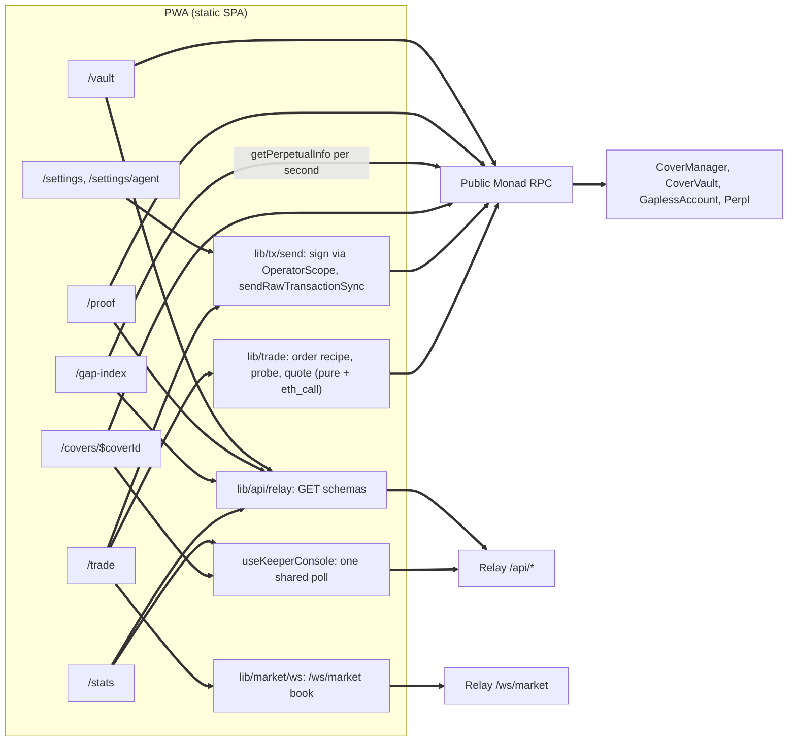

# Gapless PWA phase 2: demo surfaces

Status: **Proposed**, 2026-10-08 (WIB). Author: architect. Implementers: frontend-designer (section 7 decisions first), frontend-engineer (everything in `web/`), backend-engineer B1 (optional items in section 9 only), security-auditor (section 8), user (section 10).
Extends `web/ARCHITECTURE.md` (sections 0 to 12, ADR-W1 to ADR-W10). Nothing here replaces an existing ADR; section 2 lists the places where code built since then, or live chain state, forces an amendment. Same notation: CLI flags are written `flag:name` so this file never contains a double hyphen.

## 0. Summary

Six surfaces close the gap between the build and the demo script (`08_final_pick_and_build_plan.md` section 10, `PITCH_DECK.md` part 1):

| Surface                       | Demo beat             | Route                                       | Session        | Keeper needed to build | Keeper needed to show live                                                           |
| :---------------------------- | :-------------------- | :------------------------------------------ | :------------- | :--------------------- | :----------------------------------------------------------------------------------- |
| Trade                         | 0:35 to 1:40 core     | `/trade`                                    | yes            | no                     | Guarantee on only. Guarantee off (plain Perpl trade through the account) works today |
| Result card                   | 0:00 to 0:12          | `/proof` (new)                              | no             | no                     | paired mode yes (needs a real trigger); measured mode no                             |
| Gap Index staleness           | 0:12 to 0:35          | `/gap-index` (new)                          | no             | no                     | no                                                                                   |
| Vault                         | 2:35 to 3:00          | `/vault`                                    | no             | no                     | no                                                                                   |
| Stats                         | 2:35 to 3:00          | `/stats` (new)                              | no             | no                     | keeper section shows "unavailable" until it runs                                     |
| Cover status with keeper rows | 0:35 to 1:40          | `/covers/$coverId`                          | no (read only) | no                     | yes (nothing arms without it)                                                        |
| Owner grants agent            | 2:05 to 2:35 MetaMask | `/settings/agent` + re-grant on `/settings` | yes            | no                     | no                                                                                   |

The single most useful finding: **a plain trade does not need the keeper, sigma, or unpaused buys.** `GaplessAccount.trade` accepts order types 0 to 6 and is gated only by `perplAccountId`, `isLocked`, the operator grant and Perpl itself (`GaplessAccount.sol` `_trade`, `_checkOperator`); `pauseBuys` blocks only quotes and buys (backend CLAUDE.md "Paused markets"). So the Agora card ("authenticating via Mera, holding an AUSD balance, executing trades through Perpl") can be recorded live as soon as `/trade` ships and one real account is created and activated, independent of the keeper decision.

## 1. Facts verified for this plan (2026-10-08)

| Topic                                      | Fact relied on                                                                                                                                                                                                                                                                                                                          | Source                                                                                                                               |
| :----------------------------------------- | :-------------------------------------------------------------------------------------------------------------------------------------------------------------------------------------------------------------------------------------------------------------------------------------------------------------------------------------- | :----------------------------------------------------------------------------------------------------------------------------------- |
| Buys                                       | `CoverManager.paused()` is **true**, `marketPaused(1)` false (memory of 2026-10-07 said false; it changed since)                                                                                                                                                                                                                        | `cast call` on rpc.monad.xyz, head 111,384,565                                                                                       |
| Sigma                                      | `sigmaOf(1)` = (27, posted 111,105,484): about 279,000 blocks stale; `sigmaMaxAgeBlocks` 6,000. Every quote and probe reverts `SigmaStale` today                                                                                                                                                                                        | same                                                                                                                                 |
| Covers                                     | `liveCount(1)` 0. `/api/stats` (generated 17:27Z): covers 0, accounts 0, owners 0. No GaplessAccount has been created onchain yet; the populated `/home` screenshots used the dev bypass or predate a real create                                                                                                                       | local relay `GET /api/stats`                                                                                                         |
| Vault                                      | `totalAssets` 4.00 AUSD, `lpCount` 2, utilization 0; `config()` maxUtilization 8,000 bps, protocolFee 1,000 bps, minDeposit 1 AUSD; `COOLDOWN_BLOCKS` and `DEPOSIT_LOCK_BLOCKS` 48,300 (about 4 h)                                                                                                                                      | `cast call`, `/api/stats`                                                                                                            |
| Market params (perp 1)                     | slipAllowance 5, maxGapBpsCap 200, floorSlack 100, minStopDistance 10, marketCap 10,000, perBlockPayoutCap 2,500, maxMatchesClose 8, warmup 200, armTtl 200, exclusive 3, window 40, duration 1,000 to 48,000, sigmaMaxAge 6,000, minFee 0.02 AUSD, maxCoverNotional 20 AUSD; `marketConfig(1)` priceDecimals 1, lotDecimals 5, scale 1 | `cast call marketParams(1)`, `marketConfig(1)`                                                                                       |
| CRE onchain                                | `GaplessCreSink.lastSeq(1, 1)` = 0 and `/api/stats` `cre.reports` 0: no report has ever reached the sink                                                                                                                                                                                                                                | `cast call`, `/api/stats`                                                                                                            |
| Keeper console                             | Relay has `KEEPER_INTERNAL_URL` set; `GET /api/keeper/console` answers 503 `KEEPER_UNAVAILABLE` (keeper not running)                                                                                                                                                                                                                    | local relay                                                                                                                          |
| Native stops (7 days to block 111,383,252) | All perps: 1,273 executions, join rate 0.61. **BTC (perp 1): 905 executions, 601 joined, 851 full, 4 partial, 50 unfilled; slippage vs trigger p50 1.36, p95 6.36, max 18.11 bps; delay p50 4, p95 4 blocks**                                                                                                                           | `GET /api/gap-index/native-stops`                                                                                                    |
| Staleness (same window, BTC)               | Onchain mark publish interval p50 **50 s**, p90 51 s, mean 36 s (17,515 publishes); oracle interval p50 50 s; oracle report lag p50 1 s; mark vs oracle divergence p50 1.69, p99 11.94, max 25.08 bps; stale fraction 0                                                                                                                 | `GET /api/gap-index/staleness`                                                                                                       |
| Payload sizes                              | summary 17.5 KB, staleness 12.7 KB, native-stops 6.4 KB, premium-curve 62.6 KB, gaps 223.7 KB                                                                                                                                                                                                                                           | same                                                                                                                                 |
| Relay shapes as built                      | `/api/stats` and `/api/gap-index/*` add `stale: boolean` to `data`; stats also adds `methodVersion`, `method`, `gapless.undecodedLogs`, and `perplNativeStops` is nullable; console adds `walks.samples`, and `recent[].coverId` and `txHash` are **nullable, not optional**                                                            | `routes/stats.ts`, `routes/gapIndex.ts` (loose object), `routes/keeperConsole.ts`                                                    |
| viem 2.57.3                                | `sendRawTransactionSync({ serializedTransaction, throwOnReceiptRevert, timeout })` is exposed on the **public** client decorator (EIP-7966); `call({ account: address })` accepts a bare address; `ContractFunctionRevertedError` carries `raw`                                                                                         | viem.sh/docs/actions/wallet/sendRawTransactionSync, installed `_types/clients/decorators/public.d.ts`, `_types/errors/contract.d.ts` |
| Account                                    | `trade` allows order types 0 to 6 (no trigger orders); closes are checked against position lots; opens against `maxNotionalPerTradeCNS`; every operator trade is charged to the rolling day bucket, and **the bucket survives re-grants** (`_setOperator` checkpoints it)                                                               | `GaplessAccount.sol` lines 267, 286 to 311                                                                                           |
| Grants                                     | `setOperatorWithSig` is permissionless (any sender, owner signature checked, `opNonce++`)                                                                                                                                                                                                                                               | `GaplessAccount.sol` line 160                                                                                                        |
| Web code built                             | `OperatorScope.signTransaction` (raw signed tx, six selectors), `OwnerScope.signSetOperator` (domain checked), `unlockAccountKeys` derives both sessions in one ceremony; no send helper, no relay GET helper, no `lib/market`                                                                                                          | `web/src/lib/account/*`, `web/src/lib/api/relay.ts`                                                                                  |

## 2. Amendments to `web/ARCHITECTURE.md` (flagged, not silent)

1. **Section 8.7 row "Buys paused": "quote and trade disabled" is wrong for plain trades.** Onchain, `pauseBuys` blocks `openCover` (and so `quote`, `tradeAndCover`, `buyCover`); `trade` is unaffected. Disabling plain trades during a buy pause would block the only keeper-independent demo path. New rule: buys paused disables the Guarantee switch and "Add guarantee" with the banner's reason; plain open and close stay enabled. Exchange halted or market status not 4 still disables everything. (ADR-W13)
2. **Section 5.2 "Send: ... `writeContractSync`".** The scope wrapper as built never hands the app a viem account, so sends are: `OperatorScope.signTransaction`, then `sendRawTransactionSync` on a single-endpoint client. Same guarantees (simulate first, explicit gas, receipt in one round trip). (ADR-W12)
3. **Section 4 route table: `/gap-index` and `/stats` "out of scope (W10)"** are now in scope, plus `/proof`. `/vault` read-only moves from P1 to the demo path (beat 2:35).
4. **Section 5.2 demo stop rule "never closer than max(minDistanceBps, 15 bps)"** stays a UI default; the onchain floor is now `minStopDistanceBps` 10 (section 1).
5. **`src/utils/units.ts` uses `Number` math** (`priceToPns`, `sizeToLns`, `decimalToCns`). Fine for display; never for calldata. Every value that reaches calldata is parsed from the input string with bigint math (the plugin's `parseDecimal` rule). (ADR-W19)
6. **ADR-W6 is still open and unbuilt** (`routes/sigmaRefresh.ts` `eligible()` still requires `lotLNS > 0`). Phase 2 makes its fallback a first-class flow ("Add guarantee" on an open position, ADR-W13), so the demo no longer depends on Q4.

## 3. Component view

## 4. Architecture decisions

### ADR-W11 Public analytics routes are session-free and live under the Vault tab (Proposed)

**Context.** `/gap-index`, `/stats`, `/vault` and `/proof` show protocol data that judges must see without a passkey (PRF fails on some desktop browsers, ADR-W1). The tab bar has four slots (DESIGN 5.6).
**Decision.** None of these routes requires a session or renders an unlock card. `/vault` stays the tab; `/stats` and `/gap-index` join its fuzzy active match (same mechanism as `/covers/$coverId` under Home) and are linked from the bottom of `/vault` and from the landing's "read-only links for judges" row. `/proof` is a presentation surface: the tab bar is hidden there, like `/` and `/onboard`, so the demo's first frame is only the card.
**Alternatives.** A fifth "Stats" tab: breaks the r3 pill geometry and dilutes the trading tabs. A combined `/explore` hub: one more page for no new information.

### ADR-W12 One send pipeline: scoped signature plus single-endpoint sync send (Accepted)

**Context.** `/trade` (trade, tradeAndCover, buyCover, close), `/covers` (cancel, P1) and `/settings` (re-grant) all send operator transactions. Section 5.5 already requires one endpoint per send and no failover on revert.
**Decision.** `lib/tx/send.ts` exposes one function `sendOperatorCall(call, ctx)` that runs, in order: chain id and destination check (the clone from `accountOf(owner)`), `estimateGas` from the operator address at latest (`account: operatorAddress`), `gas = ceil(estimate x 1.2)` refused above 5,000,000, fees from the latest block (`maxPriorityFeePerGas` 2 gwei, `maxFeePerGas = baseFee x 2 + 2 gwei`), MON balance check (`gas x maxFee` must fit), nonce from `getTransactionCount(operator, 'pending')`, `OperatorScope.signTransaction`, then `sendRawTransactionSync({ serializedTransaction, throwOnReceiptRevert: false, timeout: 15_000 })` on a dedicated `createPublicClient` bound to `http(VITE_RPC_URLS[0])` only (no fallback transport). It returns a lifecycle the UI renders as state (DESIGN 9.2): `simulating`, `sending`, `confirming {hash}`, `done {receipt}`, `reverted {decoded}`, `unknown {hash}`. A module-level lock allows one unresolved hash per operator; on timeout the hash is polled with `getTransactionReceipt` and the call is never re-signed while it is unresolved. Receipt logs are decoded with the generated ABIs (`CoverBought`, `Triggered`, `Traded`).
**Consequences.** One audited path for every value-moving action. Signing never happens before a successful estimate (a revert at estimate shows the decoded error and nothing is signed).
**Alternatives.** `writeContractSync` with a viem local account: needs the session object outside the scope wrapper (rejected by ADR-W1 section 8.3). viem `fallback` for sends: a transport failure after broadcast would resend the same bytes to a second node; harmless for the nonce but it hides which node accepted it, and 5.5 already forbids it.

### ADR-W13 `/trade` separates trading from guaranteeing (Proposed)

**Context.** The demo's core beat needs a quote and a buy, which need sigma, unpaused buys and (for arm and trigger) the keeper. A plain trade needs none of these. GaplessAccount has no stop order of its own: a "stop" on Gapless exists only as a cover.
**Decision.** Three explicit paths on one page:

| Path                              | Calls                                                                                 | Needs keeper                            | Blocked by `paused()`        |
| :-------------------------------- | :------------------------------------------------------------------------------------ | :-------------------------------------- | :--------------------------- |
| Open, Guarantee off               | `trade(desc)` (orderType 0 or 1, IOC)                                                 | no                                      | no                           |
| Open, Guarantee on                | probe `tradeAndCover(desc, p, 0)` (ADR-W5), then `tradeAndCover(desc, p, maxPremium)` | yes (sigma post; later arm and trigger) | yes                          |
| Add guarantee to an open position | `quote(account, p)` (all fields known), then `buyCover(p, maxPremium)`                | yes                                     | yes                          |
| Close position                    | `trade(desc)` (orderType 2 or 3, IOC, lots = position lots)                           | no                                      | no; refused while `isLocked` |

With Guarantee off the stop field is not shown: a stop that nothing enforces would read as protection. The switch's off copy says "Stops on Gapless are guaranteed. Turn on Guarantee to set one." When the probe returns `SigmaStale` and there is no position, the page offers ADR-W6's fallback as the "Add guarantee" flow: open first (Guarantee off), call `/sigma-refresh`, wait for `SigmaPosted` (poll `sigmaOf(1)` every 2 s, at most 120 s), then quote and buy; the confirmation sheet for the open states "Your position is uncovered until you add the guarantee" (DESIGN 9.2).
**Consequences.** Agora's card can be shown live with the keeper down. The core cover beat still needs the keeper, sigma and `unpauseBuys`, and nothing in the UI pretends otherwise.
**Alternatives.** One "Review order" path that disables the whole page when sigma is stale: hides a working, bounty-relevant feature behind an unrelated outage.

### ADR-W14 No client-side indicative premium (Proposed)

**Context.** While sigma is stale every probe reverts. A premium number on screen would make the demo frame look complete.
**Decision.** The page shows no premium unless the contract produced it (probe or `quote()`). In the blocked state the Guarantee row reads "Pricing is offline: the volatility input is stale" plus the reason (`SigmaStale`, `EnforcedPause`, `KEEPER_UNAVAILABLE`), with a text link to the premium curve on `/gap-index`, which is labeled as a model at 20 AUSD notional.
**Alternatives.** Port `backend/src/jobs/premium.ts` (duplicate pricing code across packages, ADR-P1, and with a stale onchain sigma it would still not match the binding quote). Interpolate `premium-curve.json`: its `fitProposal` and `specDefault` curves are not the live `marketParams` (for example its `maxCoverNotionalCNS` is 50 AUSD, onchain is 20), so it would show a price the contract will not charge. Both rejected for a money screen.

### ADR-W15 Result card: real events only, pinned by id, validated before it claims "same stop" (Proposed)

**Context.** Beat 0:00 compares a plain Perpl stop with a Gapless cover. Gapless has zero covers today. Native stop outcomes exist per wallet (`GET /api/wallet/:addr` `nativeStops[]`, with `execTx`, `fillVwapPNS`, `slippageVsTriggerBps`) and in aggregate (`native-stops.json`). Native rows are pruned after the 7-day window.
**Decision.** `/proof` renders `ResultCard` from two real sources:

- Gapless side: `getCover(coverId)` plus single-block logs at `armedBlock` and `triggerBlock` (ADR-W7) and the `Finalized` log when present.
- Plain side: the native stop row for the paired wallet from `/api/wallet/:addr`, matched by `execTx`.
  The pair comes from validated search params (`cover`, `native`, `exec`) or, when absent, from `PROOF_PAIR` in `src/config.ts` (public ids only, `null` until a real pair exists). The card claims "Same stop, same market" only when perp ids are both 1, sides match, `triggerPNS == stopPNS`, and the native execution block is within 200 blocks of the cover's `triggerBlock`; otherwise the header reads "Two BTC stops this week" and both events are shown with their own blocks. Without a pinned Gapless trigger the card runs in **measured mode**: the plain side shows this week's BTC aggregates (905 executions, p95 6.36 bps, max 18.11 bps, 50 unfilled) and the Gapless side shows the onchain rule (`min(G_real, G_ref + A, Cap)`, A = 5 bps today) with no outcome claimed.
  **Consequences.** The card can never show a number that did not happen. A real paired recording needs the keeper (section 9). After the window passes, the plain side of a pinned pair falls back to measured mode instead of failing.
  **Alternatives.** A curated static image: not verifiable, violates the no-placeholder rule. A backend "examples" list in `native-stops.json` (worst and p95 BTC executions with tx hashes): useful for tx links in measured mode, listed as optional B1 work (section 9), not required.

### ADR-W16 Live staleness from chain reads; history from the jobs output (Proposed)

**Context.** Beat 0:12 wants "live mark and oracle lag". The relay WS `mrk` may be Perpl's offchain per-block mark (backend CLAUDE.md, sigma basis note), while native stops fire on the onchain mark. `staleness.json` has 7-day distributions but no time series.
**Decision.** The live panel polls one multicall per second while the page is visible: `getBlock('latest')` and `getPerpetualInfo(1)`. It derives `markAgeS = block.timestamp - markTimestamp`, `oracleAgeS = block.timestamp - oracleTimestampSec`, and `markVsBookBps = (markPNS - mid) / mid x 10,000` with `mid = (maxBidPriceONS + minAskPriceONS) / 2` (both sides nonempty). Samples go into an in-memory ring of 600 (10 minutes) that draws the sawtooth. The 7-day context (publish interval p50, p90, max; stale fraction; report lag; mark vs oracle divergence) comes from `staleness.json`; native outcomes from `native-stops.json`; the headline gap table from `summary.json`. `gaps.json` (224 KB) is never fetched by the PWA; `premium-curve.json` only when its section is expanded.
**Consequences.** Real, onchain, current numbers on load, no backend change. The sawtooth starts empty on page load; an optional jobs addition (`recentMarks` in `staleness.json`, section 9) would prefill an hour.
**Alternatives.** WS `mrk`: wrong source for the claim. `eth_getLogs` for `MarkUpdated` over an hour: 120 calls at the 100-block public cap. Rejected.

### ADR-W17 Keeper console: one shared poll, chain stays the source of truth (Proposed)

**Context.** The script shows "Armed at N, Triggered at N+1". ADR-W7 already uses console `recent[]` for Observed and Finalized hashes. The console is a 50-row in-memory ring, lost on keeper restart, 30 requests per minute per IP (a venue NAT shares that budget).
**Decision.** One TanStack query key `['keeperConsole']`, polled every 10 s while any consumer is visible, 5 s only on `/covers/$coverId` while the cover is non-terminal; on 429 honor `Retry-After`. Consumers: `/covers/$coverId` (a "Keeper" group listing rows whose `coverId` matches, plus the block delta badge computed from `getCover` `armedBlock` and `triggerBlock`, never from the console) and `/stats` (status, head lag, signer balance, governor used vs cap, last 10 actions, walk gap p50 and max). 503 renders the inline banner "Keeper status unavailable" (DESIGN 5.8) and every chain-derived value keeps working.

### ADR-W18 `/vault` is read-only and every disclosure number is read live (Proposed)

**Decision.** One multicall: vault `totalAssets`, `totalSupply`, `reservedTotal`, `reserved(1)`, `freeAssets`, `utilizationBps`, `owedTotal`, `config()`, `paused`, `COOLDOWN_BLOCKS`, `DEPOSIT_LOCK_BLOCKS`, `blockPayout(1)`; manager `marketParams(1)` and `liveCount(1)`. `lpCount`, premiums to LPs and payouts come from `/api/stats`. The max-loss card is built from these values, never from constants in copy. LP actions (deposit, request and claim redeem) stay P2 and out of the operator scope (ARCHITECTURE 8.3).

### ADR-W19 Calldata values are bigint end to end (Accepted)

**Decision.** `lib/trade/order.ts` parses size, stop and limit strings with integer decimal parsing (reject more fractional digits than `priceDecimals` or `lotDecimals`), computes every derived value with bigint (`notionalCNS = lots x stopPNS x scale`, `capCNS = notional x maxGapBps / 10,000` floor, `maxPremium = quoted + floor(quoted x 200 / 10,000)`, limits with ceil for longs and floor for shorts), and checks the 500 bps mark band with the contract's integer test. Its tests use the plugin's vectors (copied, not imported: `plugin/src/lib/cover.ts` `openLimit`, `openDesc`, `withinMarkBand`, `maxPremium`, `capOf`). `units.ts` float helpers are display only.

## 5. Route specifications

Every route below follows DESIGN 10's states (loading, empty, error) and maps `error.code` or decoded revert names through `lib/errors.ts`, never relay `message`.

### 5.1 `/trade` (full build)

**Layout** is DESIGN 8.2 unchanged (calm frame, regular cards, no big cards), plus one card: a **Position card** between the book and the form when `getPosition(1, id).lotLNS > 0` (side with arrow, lots and BTC, entry, PnL signed, cover status chip linking to `/covers/$coverId`, actions "Add guarantee" when no active cover and "Close position" as destructive).

**Reads.**

| Query                                                                    | Contents                                                                                                                                                                                                           | Cadence                            |
| :----------------------------------------------------------------------- | :----------------------------------------------------------------------------------------------------------------------------------------------------------------------------------------------------------------- | :--------------------------------- |
| `marketStatic`                                                           | `marketConfig(1)`, `marketParams(1)`                                                                                                                                                                               | once, `staleTime` 5 min            |
| `tradeChain` (one multicall, plus `getBlock` and `getBalance(operator)`) | `sigmaOf(1)`, `paused()`, `marketPaused(1)`, `activeCoverOf(account, 1)`, `isLocked(account, 1)`, `getPerpetualInfo(1)`, `isHalted()`, `getPosition(1, id)`, `getAccountById(id)`, `operator()`, `operatorUsage()` | every 1 s while visible            |
| `/ws/market`                                                             | book (5 levels, "Show 20 levels"), trades, display prices                                                                                                                                                          | live (section 5.2 of the main doc) |

**Form state machine** (derived each render, top to bottom; the first match sets the action bar's disabled reason):

| Condition                                                                                     | Action bar                                                                                          |
| :-------------------------------------------------------------------------------------------- | :-------------------------------------------------------------------------------------------------- |
| No session                                                                                    | unlock card in place                                                                                |
| `deriveOnboardStep` is not `ready`                                                            | "Finish setup" link (`operator-replaced` and `session-expired` link to the re-grant on `/settings`) |
| `isHalted()` or perp status not 4                                                             | disabled: "Perpl has halted trading"                                                                |
| operator MON < `gas x maxFee` for the estimate                                                | disabled: "Your trading key needs MON for gas"                                                      |
| input invalid (lots 0, more decimals than allowed, limit outside 500 bps of the onchain mark) | disabled with the field's reason                                                                    |
| open notional > `maxNotionalPerTradeCNS` or > `operatorUsage().availableCNS`                  | disabled: "Daily limit reached: X left"                                                             |
| Guarantee on and `paused()` or `marketPaused(1)`                                              | Guarantee switch disabled with the banner reason; plain trade still allowed                         |
| Guarantee on and the probe failed                                                             | quote row shows the decoded error block (DESIGN 5.9), action disabled                               |
| Guarantee on and `activeCoverOf != 0`                                                         | "You already have a cover on BTC"                                                                   |
| otherwise                                                                                     | "Review order"                                                                                      |

**Guarantee on, no position** (ADR-W5 unchanged): debounce 400 ms after any input change, then `call({ account: operator, to: account, data: tradeAndCover(desc, p, 0) })`; `PremiumTooHigh(quoted, 0)` is the price. Quote block = the head it ran at. Sheet shows "Refresh quote" instead of Confirm when the head is more than 30 blocks past the quote block or the onchain mark moved more than 50 bps since. Shown before the trade: total (quoted), Cap, expiry block and approximate time, warm-up (200 blocks, about 1 min), rent floor `minFeeCNS x ceil(T / 12,000)` tagged non-refundable.
**Guarantee on, position open:** `quote(account, p)` gives every field (escrow, rent, cap, fee bps, utilization after, distance and minimum distance, expiry).
**`SigmaStale`:** if a position exists and `/sigma-refresh` is eligible, call it (`{ perpId: 1, account }`, number perpId), show "Refreshing price inputs, about a minute", poll `sigmaOf(1)` for a `postedBlock` change, re-quote. If the relay answers 503 `KEEPER_UNAVAILABLE`, show "Pricing is offline" (ADR-W14). If no position exists, offer the open-first flow (ADR-W13).

**Order recipe** (unchanged from section 5.2 of the main doc and the plugin): IOC, `maxMatches` 32, `maxNegPnlCollatBPS` 300, `expiryBlock` 0, `lastExecutionBlock` 0, `leverageHdths` 300 default; open limit = best opposite onchain price x (1 +/- 50 bps); close limit = best same-side onchain price x (1 -/+ 50 bps) (closing a long sells into bids); limits and mark from chain reads only, never from the WS.

**Confirmation sheet** (DESIGN 9.1) built from decoded calldata of the exact call about to be signed. Close-position sheet adds the cover consequence: an active Live cover is voided (`PositionClosedOrFlipped`) and its escrow follows the M-03 rule (refunded unless the cover was ever armed or the mark is inside the stop zone), stated as "Escrow refunded: X AUSD. Rent kept: Y AUSD".

**After send** (ADR-W12): `tradeAndCover` or `buyCover` decode `CoverBought` from the receipt (manager address, `coverId` topic) and navigate to `/covers/$coverId` (fixed internal path). A plain trade stays on `/trade`, shows Done with the MonadVision link, and the Position card appears from the next read. Reverted shows the decoded reason in the action bar area, never a toast.

**Budget note for the demo** (copy and rehearsal planning): a 22-lot open is about 19 AUSD of the 100 AUSD rolling day bucket, a close the same, a covered open about 38 (section 5.2 of the main doc). The bucket survives re-grants, so rehearsals on the demo account eat the recording day's budget. Rehearse on a second account.

**Dev bypass** must not reach `/trade`: no simulated quotes, no simulated sends.

### 5.2 `/proof` (Result card, new)

Search schema (zod, all optional): `cover` `^0x[0-9a-fA-F]{64}$`, `native` checksummed address, `exec` `^0x[0-9a-fA-F]{64}$`. Resolution: params, else `PROOF_PAIR`, else measured mode.

**Gapless side (chain):** `getCover(coverId)`; logs at `triggerBlock` (`Triggered`: `filledLots`, `realizedCNS`, `gRealCumCNS`, `paidNowCNS`, `owedCNS`, tx hash), at `armedBlock` (`Armed`), and `Finalized` per ADR-W7. Derived, all bigint: `notionalCNS = filledLots x stopPNS x scale`; `paidCNS = cover.paidCNS + cover.owedCNS`; `residualCNS = max(0, gRealCumCNS - paidCNS)`; exit vs stop in bps `= residualCNS x 10,000 / notionalCNS`. Copy: "Exited at the stop" only when `residualCNS == 0` and the cover is Finalized; before that "Paid X now, top-up pending". "1 tx" is shown only when the trigger tx's `Triggered` log has `filledLots > 0` and `paidNowCNS > 0`. "Armed #N, Triggered #M, M minus N blocks" from the struct; `armedBlock == 0` reads "Triggered on the fast path (mark through the stop), no arm needed".
**Plain side (relay):** `/api/wallet/:native?limit=50`, the row whose `execTx` equals `exec` (or the newest `joined` BTC row if `exec` is absent): `triggerPNS`, `fillVwapPNS`, `filledLNS`, `slippageVsTriggerBps`, `delayBlocks`, `execTx`, `executedBlock`. Gap in AUSD = `filledLNS x |triggerPNS - fillVwapPNS| x scale` (display math, the row is already floats).
**Pairing check:** ADR-W15. Lead with bps, AUSD second: at demo size (22 lots, about 19 AUSD) a typical BTC gap is under a cent, and the card says so plainly rather than extrapolating to a larger notional.
**Placement:** route `/proof` (no tab bar), plus a compact variant on the landing below the statements only when `PROOF_PAIR` is set.

### 5.3 `/gap-index` (new)

Top to bottom:

1. **Live staleness (hero card).** "BTC mark age" in `type-num-hero` seconds, oracle age and mark vs book bps as the supporting row, the 10-minute sawtooth (ADR-W16), freshness label "Live · #block" (DESIGN 8.1 rule 5). The only live zone on the page.
2. **This week** (grouped list from `staleness.json` BTC): mark publish interval p50, p90, max; oracle interval p50; report lag p50; mark vs oracle divergence p50, p99; share of time older than 60 s. Other perps in a collapsed list.
3. **What native stops did** (`native-stops.json`): BTC executions, full, partial, unfilled; slippage vs trigger p50, p95, max; delay p50 and p95 blocks; join rate stated next to the numbers (outcomes are computed on joined rows only).
4. **How often stops get hit** (`summary.json` headline rows for BTC): hit probability at 100 bps over 12,000 blocks, mark gap p99 and max.
5. **Premium model** (collapsed; fetches `premium-curve.json` on expand): fee bps by distance, labeled "Model at 20 AUSD, not a quote" (ADR-W14).
6. **Method** (collapsed): each document's `method` text and `generatedAt`; `stale: true` shows the inline stale banner.

Polling: Gap Index documents every 60 s at most (relay caches 60 s, 60 requests per minute per IP).
Wallet drill-down `/gap-index/wallet/$addr` (Perpl Analytics card "portfolio intelligence") stays P2.

### 5.4 `/vault` (full read-only build)

DESIGN 10 `/vault` as specified (TVL big card with the utilization ring), filled per ADR-W18. Below it, regular cards:

- **Capacity:** reserved total and BTC reserved, free assets, owed (deferred payouts), live covers.
- **Returns:** premiums to LPs and to the treasury (from `/api/stats`), protocol fee 10%, LP count, share price `convertToAssets(10^12)` (12 share decimals: AUSD 6 plus offset 6).
- **Max loss** (full card, `type-body`, never a footnote), every number read live: worst case LPs lose the reserved liability, which the vault caps at `maxUtilizationBps` (80%) of assets; per market per block payouts stop at `perBlockPayoutCapBps` (25%) of assets and the rest is owed and paid later; each cover's payout is at most its Cap, notional x max gap (at most `maxGapBpsCap`, 2%) on at most `maxCoverNotionalCNS` (20 AUSD); deposits lock and redemptions cool down `COOLDOWN_BLOCKS` (48,300, about 4 h), and a claim waits when free assets are short.
- Links: "Protocol stats" and "Gap Index".

### 5.5 `/stats` (new)

Source: `GET /api/stats` (shape in section 6) plus the shared keeper console query. Hero: total covers in `type-num-hero` (honest zero with "No covers yet" while `total == 0`). Grouped lists:

| Group                  | Rows                                                                                         |
| :--------------------- | :------------------------------------------------------------------------------------------- |
| Covers                 | live, armed, triggered, finalized, expired, cancelled, voided, each with its DESIGN 2.5 chip |
| Money                  | notional covered, rent, escrow to vault, to LPs, to treasury, payouts (count, paid, owed)    |
| Speed                  | arm to trigger blocks p50 and max with n (and "about N ms" at the measured block time)       |
| Vault                  | TVL, LPs, utilization, link to `/vault`                                                      |
| Native stops this week | executions, join rate, slippage p50 and p95, delay p50 and p95, link to `/gap-index`         |
| CRE                    | reports, armed, triggered                                                                    |
| Firsts                 | deploy, first cover, first trigger as MonadVision links (`null` renders "not yet")           |
| Keeper                 | ADR-W17                                                                                      |

Footer: `generatedAt` as "Updated N min ago"; `stale` shows the inline banner. 503 `STATS_NOT_READY` is an empty state, not an error.

### 5.6 `/covers/$coverId` (additions to section 5.3 of the main doc)

The stepper and reads stay as specified there. Add: the block delta badge on the Triggered step ("Armed #N, Triggered #N+1, 1 block"); the "1 transaction" line on the Triggered step from the `Triggered` log (filled lots, paid now, same hash); a "Keeper" grouped list (ADR-W17) with action, block, outcome and tx for rows matching this cover. The page needs no session (all reads are public); cancel (P1) needs one and shows the unlock card only inside its sheet.

### 5.7 `/settings` and `/settings/agent` (F-1): spec check against the built code

Section 7 of the main doc still holds. Differences the implementation must follow:

| Spec point                          | What the built code changes                                                                                                                                                                                                                                                                                                        |
| :---------------------------------- | :--------------------------------------------------------------------------------------------------------------------------------------------------------------------------------------------------------------------------------------------------------------------------------------------------------------------------------- |
| 7.2 step 5 "fresh passkey ceremony" | `unlockAccountKeys(loadCredentialHint())` always derives owner and operator. Set only the owner into the store for the signature, `endOwnerSession()` right after; end the freshly derived operator session if one is already live (same key), set it only if none is live                                                         |
| 7.1 domain check                    | `OwnerScope.signSetOperator(onchain, expected, msg)` exists; expected = `{ name: 'GaplessAccount', version: '1', chainId: 143, verifyingContract: account }`, onchain from the clone's `eip712Domain()` (present in the generated ABI). Add one `expectedAccountDomain(account)` helper next to the factory one used by `/onboard` |
| 7.1 nonce                           | `opNonce()` read in the same multicall as the domain, immediately before signing                                                                                                                                                                                                                                                   |
| 7.3 re-grant                        | submitted through ADR-W12 (`setOperatorWithSig` is already in the operator scope allowlist; the call is permissionless, so a replaced or expired operator can still submit it). `writeContractSync` in the memory notes is superseded                                                                                              |
| 7.2 step 7                          | `/onboard`'s `operator-replaced` and `session-expired` cards currently say "needs a feature that is not built yet"; they link to `/settings` "Renew this device" once 7.3 ships                                                                                                                                                    |
| New copy fact                       | Re-granting does not refill the daily budget (the bucket is checkpointed across grants)                                                                                                                                                                                                                                            |
| 7.2 step 6 output                   | The UI string uses the real plugin flags (`account`, `expiry`, `deadline`, `max-per-trade`, `max-per-day`, `sig`, matching `plugin/src/ops/link.ts`); this document writes them as `flag:` only                                                                                                                                    |

`/settings` index (P1 in the main doc) gets the Session group now, because it hosts "Renew this device". Withdraw stays blocked on pinning `WITHDRAW_TYPEHASH` (memory note), as before.

## 6. Interface contracts (relay GET routes consumed)

Add to `lib/api/relay.ts` one `getJson(path, schema)` with the same envelope handling as `postJson`, a 10 s timeout, and `Retry-After` handling on 429. Schemas use `z.object` (unknown keys stripped, never strict), so additive relay fields never break the page. Validate only the fields rendered.

| Route                              | Rate limit, cache       | Fields the PWA validates                                                                                                                                                                                                                                                                | Errors                                               |
| :--------------------------------- | :---------------------- | :-------------------------------------------------------------------------------------------------------------------------------------------------------------------------------------------------------------------------------------------------------------------------------------- | :--------------------------------------------------- |
| `GET /api/stats`                   | 60 per min per IP, 60 s | PARALLEL section 6 shape plus `stale: boolean`; `perplNativeStops` nullable; `armToTriggerBlocks.p50` and `max` nullable numbers; `vault.totalAssetsCNS` nullable decimal string; `firsts.*` nullable lowercase hashes                                                                  | 503 `STATS_NOT_READY` (empty state)                  |
| `GET /api/gap-index/staleness`     | 60 per min, 60 s        | `generatedAt`, `stale`, `window {fromBlock, toBlock, seconds}`, `perps[] {perpId, symbol, mark {publishes, intervalSec {p50, p90, max, mean}, staleFraction, ageSecAtWindowEnd}, oracle {intervalSec, reportLagSec, staleFraction}, markOracleDivergenceBps {p50, p99, max}}`, `method` | 503 `GAP_INDEX_NOT_READY`                            |
| `GET /api/gap-index/native-stops`  | same                    | `totals` and `perps[] {perpId, symbol, executions, joined, joinRate, full, partial, unfilled, slippageVsTriggerBps {n, p50, p95, max}, delayBlocks {n, p50, p95, max}}`, `window`, `method`                                                                                             | same                                                 |
| `GET /api/gap-index/summary`       | same                    | `perps[] {perpId, symbol, lastMark {price, block}, headline[] {side, distanceBps, horizonBlocks, pHit, markGapP99Bps, markGapMaxBps, distinctTriggers}}`                                                                                                                                | same                                                 |
| `GET /api/gap-index/premium-curve` | same, fetched on expand | `method.inputs`, `perps[] {perpId, curves {fitProposal[], specDefault[]} {distanceBps, allowed, rejectReasons, feeBpsE2, escrowCNS, rentCNS}}`                                                                                                                                          | same                                                 |
| `GET /api/keeper/console`          | 30 per min, 2 s         | as `routes/keeperConsole.ts` `consoleSchema` (section 1 note: nullable `coverId` and `txHash`, `walks.samples`)                                                                                                                                                                         | 503 `KEEPER_CONSOLE_DISABLED`, `KEEPER_UNAVAILABLE`  |
| `GET /api/wallet/:addr?limit=50`   | 20 per min, 60 s        | `nativeStops[]` as `AccountNativeStop` (`backend/src/jobs/native-ingest.ts`), `gapless` nullable                                                                                                                                                                                        | 404 `ACCOUNT_NOT_FOUND`, 503 `WALLET_DATA_NOT_READY` |

All relay data is display data (ADR-W9): none of it reaches calldata, typed data or a destination address.

## 7. Design handoff (frontend-designer, before the new pages are built)

Patterns that already apply, no new decision needed: big cards for the vault TVL card, the stats hero and the `/gap-index` live hero (5.4.1); grouped lists for everything else (5.4, rule "no dense stat grids"); status chips (2.5) on `/stats` and the Position card; stepper (5.13) on covers; confirmation sheet (9.1) for every send; pill tab bar (5.6) with the ADR-W11 mapping; `/trade` calm-frame rules (8) for the Position card; zero-motion rules (7.3): numbers never animate.

New visual decisions needed (r4):

1. **Sawtooth and chart style** for the live staleness panel: hand-drawn SVG polyline (no chart dependency), how the 60 s staleness threshold line and the 1 s timestamp granularity read, repaint cadence (1 per second, no transitions), reduced-motion behavior (none needed: it is data, not motion, but confirm).
2. **ResultCard**: two-sided composition at phone width and at 1080p recording size, how "plain" vs "Gapless" are distinguished without using red and green as decoration (DESIGN 12), measured-mode treatment, and where the "Two separate events" downgrade header sits.
3. **`/trade` Guarantee-off state**: removing the stop field and the off-copy, and the Position card (regular card) placement and its two actions.
4. **Tab bar mapping** for `/stats` and `/gap-index` under Vault, and the hidden bar on `/proof`.
5. **Keeper rows** in the cover stepper and the block delta badge.

## 8. Security considerations

- **Send path (ADR-W12).** Scope wrapper is the only signer; destination must equal `accountOf(owner)` read from chain; chain id 143; value 0; explicit gas at most 5,000,000; single endpoint; one unresolved hash per operator; decoded-calldata sheet (main doc 8.5). Unit tests: refusal of a non-clone destination, of an estimate revert (nothing signed), of a second send while a hash is unresolved; decoded `CoverBought` from a recorded receipt.
- **Probe and quote** are `eth_call` from the operator address: no signing, no session key exposure.
- **Owner signatures (F-1).** Owner key live for one signature; domain hard stop on mismatch (DESIGN 9.2); the output is copied by the user, never sent anywhere (main doc 7.2).
- **Public routes.** Search params zod-validated (`/proof`); explorer links only from validated hashes and addresses; no `dangerouslySetInnerHTML` for charts (SVG as JSX, like the QR); relay strings rendered as text; the `method` texts are relay-controlled display strings, rendered as text and length-capped.
- **Rate limits at a venue.** Judges on one Wi-Fi share each per-IP budget. Shared query keys, the polling intervals above, visibility-gated polling, and 429 backoff keep one tab well inside each limit; a 429 shows the last value with "Updated N s ago", never an error wall.
- **No new origins**: CSP `connect-src` already covers the RPCs and the relay (main doc 8.4). No chart, CDN or font addition.
- security-auditor scope for phase 2: `lib/tx/send.ts`, `lib/trade/*`, `/settings/agent` signing, the GET schemas, `/proof` param handling.

## 9. Implementation order (phase 2 only)

Gate legend: **None** = buildable and demonstrable now. **Account** = needs one real created and activated account (relay sponsor is enabled locally; no account exists onchain yet). **Keeper** = needs the keeper running with a key that holds `SIGMA_ROLE`, sigma posted, and `unpauseBuys`. The keeper decision is the user's (main doc Q9); nothing below decides it.

| #   | Work                                                                                                                                                                                                                                                                                   | Agent                                        | Depends on                                       | Gate to build                                                           | Gate to show live                                             | Est.          |
| :-- | :------------------------------------------------------------------------------------------------------------------------------------------------------------------------------------------------------------------------------------------------------------------------------------- | :------------------------------------------- | :----------------------------------------------- | :---------------------------------------------------------------------- | :------------------------------------------------------------ | :------------ |
| 1   | DESIGN r4 decisions (section 7)                                                                                                                                                                                                                                                        | frontend-designer                            | none                                             | None                                                                    | None                                                          | 2 h           |
| 2   | Shared layer: `getJson` + schemas (section 6), `lib/tx/send.ts` (ADR-W12), `lib/trade/order.ts` (ADR-W19, plugin vectors), `useKeeperConsole`, components ConfirmSheet, StatusChip, GroupedList, Segmented, TxLifecycle; unit tests                                                    | frontend-engineer                            | none                                             | None                                                                    | None                                                          | 5 to 6 h      |
| 3   | `/vault` read-only (5.4)                                                                                                                                                                                                                                                               | frontend-engineer                            | 2                                                | None                                                                    | None                                                          | 2 h           |
| 4   | `/stats` (5.5) with the keeper group rendering its 503 state                                                                                                                                                                                                                           | frontend-engineer                            | 2                                                | None                                                                    | None (keeper group: Keeper)                                   | 2 to 3 h      |
| 5   | `/gap-index` with the live staleness panel (5.3)                                                                                                                                                                                                                                       | frontend-engineer                            | 1, 2                                             | None                                                                    | None                                                          | 4 h           |
| 6   | `lib/market/ws.ts` and `/trade` frame: header, book, form, validation, Guarantee off open, Position card, close position (5.1, ADR-W13)                                                                                                                                                | frontend-engineer                            | 1, 2                                             | None                                                                    | **Account**                                                   | 6 to 8 h      |
| 7   | `/settings` Session group, `/settings/agent` (F-1), re-grant (7.3), wire `/onboard` end-state cards                                                                                                                                                                                    | frontend-engineer                            | 2                                                | None                                                                    | **Account** (and W3c plugin demo after it)                    | 3 to 4 h      |
| 8   | `/covers/$coverId` stepper, logs (ADR-W7), keeper rows (5.6)                                                                                                                                                                                                                           | frontend-engineer                            | 2                                                | None                                                                    | **Keeper** (no cover exists to render)                        | 3 h           |
| 9   | Guarantee on: probe, quote, `/sigma-refresh` flow, `tradeAndCover`, `buyCover`, navigate to cover (5.1)                                                                                                                                                                                | frontend-engineer                            | 6, 8                                             | None (states verified against today's `SigmaStale` and `EnforcedPause`) | **Keeper**                                                    | 3 h           |
| 10  | `/proof` ResultCard, measured mode first, paired mode (5.2, ADR-W15)                                                                                                                                                                                                                   | frontend-engineer                            | 1, 2, 8                                          | None                                                                    | measured: None; paired: **Keeper** plus a planned paired stop | 3 h           |
| 11  | Optional B1: (a) ADR-W6 eligibility relaxation, (b) `recentMarks` (last hour of BTC `MarkUpdated` block and timestamp) in `staleness.json`, (c) `examples` (worst and p95 BTC executions with tx hashes) in `native-stops.json`; bump `METHOD_VERSION`; relay unchanged (loose object) | backend-engineer B1                          | none                                             | None                                                                    | (a) only matters with **Keeper**                              | 1 to 2 h each |
| 12  | SE review (section 8), test-runner, code-reviewer                                                                                                                                                                                                                                      | security-auditor, test-runner, code-reviewer | 2, 6, 7, 9                                       | None                                                                    |                                                               | 2 to 3 h      |
| 13  | Live verification run: create and activate a real account, plain open and close on mainnet, record Agora beat                                                                                                                                                                          | user, frontend-engineer                      | 6, relay reachable from the device (main doc Q3) |                                                                         | **Account**                                                   | 1 h           |
| 14  | Core beat: keeper up, sigma posted, `unpauseBuys`, covered open, arm, trigger, paired native stop for `/proof`                                                                                                                                                                         | user, ops                                    | 8, 9, 10, keeper decision                        |                                                                         | **Keeper**                                                    | demo day      |

**Runs in parallel right now:** 1, 2, 11, then 3, 4, 5, 6, 7 as soon as 2 lands. Items 8 to 10 can be built now but only render real data after the keeper runs. Critical path to an honest core beat: 2, 6, 9, 8, then the keeper decision. Critical path to the Agora beat: 2, 6, 13 (no keeper).

## 10. Open questions for the user

| #     | Question                                                                                                                                                                                   | Recommendation                                                                                                                                            | Needed by |
| :---- | :----------------------------------------------------------------------------------------------------------------------------------------------------------------------------------------- | :-------------------------------------------------------------------------------------------------------------------------------------------------------- | :-------- |
| P2-Q1 | Plan a paired stop for `/proof`: one plain Perpl BTC stop on a second wallet (Perpl's app) at the same price as a covered Gapless long, during the recording window                        | Yes, with a tight stop (10 to 15 bps) so a crossing is likely in the cover window; otherwise record measured mode and say so                              | Item 14   |
| P2-Q2 | Voiceover numbers: the script's "mark trailed the book by 9 to 15 seconds" (sampled Oct 1) does not match this week's data (BTC onchain mark published every 50 s at the median, max 51 s) | Quote what the live panel shows on recording day, or the 7-day medians; drop the fixed "9 to 15 s"                                                        | Recording |
| P2-Q3 | "50 of 905 BTC native stop executions filled nothing" is in the data. Use it on camera?                                                                                                    | Only after checking a few `unfilled` rows on MonadVision (the method says "no taker fill", which may include stops on positions already closed elsewhere) | Recording |
| P2-Q4 | Rehearsal account: the day bucket (100 AUSD) survives re-grants                                                                                                                            | Rehearse on a second sponsored account (`TOTAL_CREATE_CAP` 6 allows it)                                                                                   | Item 13   |
| P2-Q5 | ADR-W6 (main doc Q4)                                                                                                                                                                       | Not required for the demo any more (open-first flow); still nicer as one transaction                                                                      | Item 9    |

## 11. Status findings outside `web/` (reported, not designed)

- **No git repository** exists at the project root (`git rev-parse` fails), although `.github/workflows/ci.yml` does. Envio Cloud deploys from a GitHub branch, and the submission requires a public repo with commit history across the window (PARALLEL W0). This blocks Envio Cloud outright and is a submission risk.
- **Envio HyperIndex:** built and tested locally (memory `indexer_w1_2026-10-06.md`); not deployed to Cloud (RUNBOOK section 16 item 2 open; impossible without the repo). The Envio card can still be argued from HyperSync, which powers the jobs behind `/gap-index` and `/stats` and is running now; the phase 2 pages are its visible proof.
- **CRE:** CLI v1.37.0 installed and logged in (`~/.cre/cre.yaml` dated 2026-10-06 19:37); a build artifact from 19:52 suggests a compile or simulate attempt, but no dry-run log is recorded anywhere and RUNBOOK 16 item 4 is still open. No broadcast: sink `lastSeq(1, 1)` is 0 and `cre.reports` is 0. Production deploy is not built (stretch). Handlers 0 and 1 can be dry-run today without the keeper; handler 2 needs a real `Armed` tx (keeper); the one broadcast needs the keeper key with the keeper stopped (ADR-P5), which interacts with the pending rotation.
- **Keeper console:** wired on the relay, keeper not running, so 503 today. Its frontend homes are `/covers/$coverId` and `/stats` (ADR-W17).
